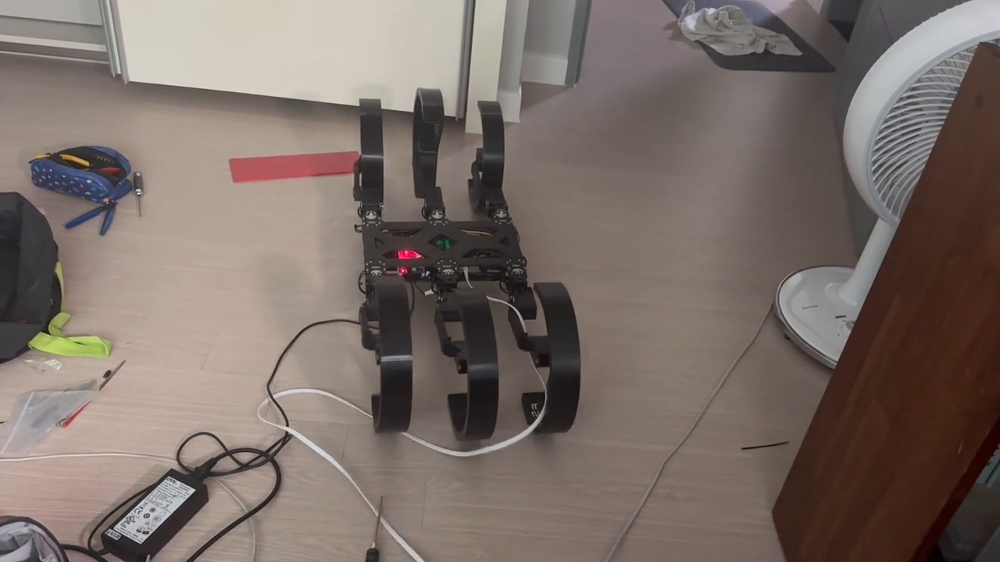
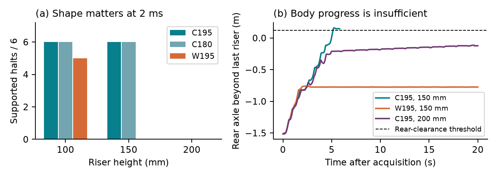
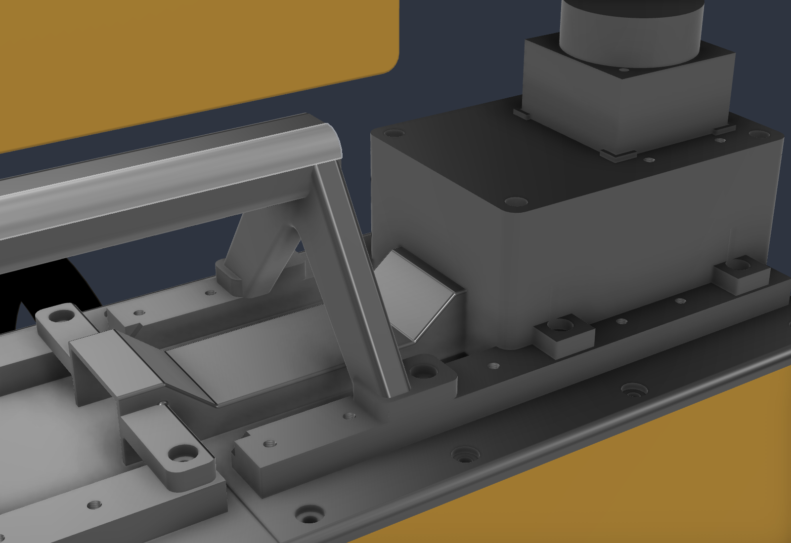

# SCONE

**도움이 필요한 사람에게 직접 찾아가는 로봇을 만들고 싶었습니다.**<br>
**Building a robot that can bring help to the person who needs it.**

Six-legged robot Capable Of rotational motioN · 김형석 / Hyoung-Seok Kim

[한국어](#한국어) · [English](#english) · [Posters & papers](#posters-and-papers) · [Videos](#videos) · [Development archive](#development-archive)



*SCONE v2의 실제 제작·동작 기록에서 가져온 장면입니다. / A frame from the original SCONE v2 hardware footage.*

> **보관된 프로젝트 / Archived project · 2026-10-09**<br>
> 제작 과정, 소스, 포스터, 논문, 실물 영상과 후속 설계를 함께 보존합니다.<br>
> Hardware history, source code, posters, papers, videos and later designs are preserved here.<br>
> [전체 정리 및 복원 안내 / Project closeout and restoration](docs/31-project-archive.md)

## 한국어

### 왜 만들었는가

고등학교에서 동아리를 홍보하던 중 친구가 쓰러진 일이 있었습니다.
그 일을 겪으며, 의식을 잃은 사람을 혼자 힘으로 옮기는 일이 얼마나 어려운지 실감했습니다.
도움이 필요한 사람에게 필요한 장비가 직접 찾아갈 수 있다면 어떨까 하는 생각이 들었습니다.

그 경험이 SCONE을 만들기 시작한 계기였습니다. 사람에게 직접 도달할 수 있는 이동 로봇을 만들고,
그 로봇을 **자동제세동기(AED)를 환자에게 전달하는 로봇으로 응용해 보았습니다.**
그 과정에서 중요하게 생각한 것은 평지에서 움직이는 것뿐 아니라, 실제 이동 경로에서 마주치는
계단과 턱도 통과할 수 있는 구조였습니다.

이 질문은 친환경 배송과 응급 장비 전달이라는 두 응용으로 이어졌습니다.
초기 논문과 포스터에는 배송 로봇의 이동 문제, 제작 과정, 실패와 개선을 정리했고,
포스터의 마지막에는 AED 같은 중요한 물품을 필요한 사람에게 직접 전달하는 방향을 담았습니다.
이 저장소는 그 생각이 실제 로봇, 실험, 설계와 코드로 발전한 기록입니다.

### 어떤 로봇인가

SCONE은 다리 끝에 **C자형 부채꼴 바퀴**를 붙인 6족 로봇입니다.
같은 말단 구조를 회전시키거나 다리 관절을 움직여 걷기, 구르기와 계단 이동을 탐구했습니다.
초기 실물은 3D 프린팅 프레임과 DYNAMIXEL 모터로 제작했고, 이후에는 MuJoCo에서 접촉 기하,
보행 제어와 계단 자세를 비교하며 동작을 분석했습니다.

이 저장소에는 다음 작업이 함께 들어 있습니다.

- **실물 제작:** 초기 평행 링크 구조, 프레임·타이어·모터·전원 개선과 v1/v2 동작 영상.
- **이동 제어:** Walk/Drive/Climb, 교대 삼각보, 연속 굴림과 다리별 굴림·보행 역할 분리.
- **시뮬레이션과 학습:** MuJoCo 모델, 지형 생성, PPO 학습, 다리 상실 대응과 반복 벤치마크.
- **후속 설계:** MARC 계열의 4족 기구, 하우징, 팔, Jetson·U2D2 배치 및 전원 검토.

자료에는 성공한 동작과 함께 전원 부족, 미끄러짐, 모터 과부하, 프레임 문제와 실패한 실험도 남겼습니다.
실물 제작 영상과 후속 시뮬레이션의 정량 실험은 각각의 조건과 근거를 따라 읽을 수 있도록 구분했습니다.

## English

### Why I built it

The idea began when a friend collapsed while I was promoting a club at my high school.
That experience made me realize how difficult it can be for one person to move someone who has lost consciousness.
I began thinking about a robot that could bring essential equipment directly to the person who needed it.

That became the starting point for SCONE. I wanted to build a mobile robot that could reach people,
and I explored **delivering an automated external defibrillator (AED) as an application.**
The mobility problem mattered: reaching a person could mean dealing with stairs and curbs as well as a flat floor.

The project connected that motivation with two applications: environmentally friendly delivery and emergency equipment delivery.
The original papers and poster document the delivery problem, construction, failures and improvements.
The poster also presents bringing vital supplies such as an AED directly to the recipient as a future application.
This repository preserves how that idea developed into hardware, experiments, designs and software.

### What SCONE is

SCONE is a six-legged robot with **C-shaped arc wheels at the ends of its limbs**.
By rotating the terminal frames and articulating the legs, I explored walking, rolling and stair climbing
with the same mechanism. The early hardware used 3D-printed parts and DYNAMIXEL actuators.
Later work used MuJoCo to study contact geometry, gait control and stair postures.

The archive brings together:

- **Hardware development:** the original parallel-link design, frame, tire, actuator and power revisions, and v1/v2 footage.
- **Locomotion:** Walk/Drive/Climb, tripod walking, continuous rolling and per-leg rolling/stepping roles.
- **Simulation and learning:** MuJoCo models, generated terrain, PPO training, leg-loss adaptation and repeated benchmarks.
- **Later designs:** the four-legged MARC mechanism, housing, arm, Jetson/U2D2 integration and power-system review.

The records include successful motions and the problems encountered along the way: insufficient power,
slipping, actuator overload, structural issues and failed trials.
The historical hardware footage and the quantitative simulation studies retain their own experimental context.

## Posters and papers

### 제작 포스터 / Original project poster

실제 제작 사진, v1에서 v2로의 개선, 실험 결과와 AED 전달 응용을 한 장에 담은 포스터입니다.
The original poster brings together hardware photos, the v1-to-v2 improvements, experiments and the AED delivery application.

[](archive/assets/Eco-friendly%20deliver%20SCONE%20Poster.jpg)

[원본 포스터 열기 / Open the full-resolution poster](archive/assets/Eco-friendly%20deliver%20SCONE%20Poster.jpg)

### 연구 요약 / Quad chart

연구 질문, 제작 방법, 초기 결과와 개선 방향을 정리한 원본 요약 자료입니다.
The original quad chart summarizes the research question, methods, early results and planned improvements.

[](archive/assets/Eco-friendly%20deliver%20SCONE%20Quad%20Chart.png)

[원본 요약 자료 열기 / Open the full-resolution quad chart](archive/assets/Eco-friendly%20deliver%20SCONE%20Quad%20Chart.png)

### 초기 논문과 도면 / Original papers and drawing

| 자료 / Material | 내용 / Contents | 원본 / Original |
| --- | --- | --- |
| **회전운동이 가능한 6족 로봇, 스콘의 개발** | 제21회 KSEF 과학프로젝트대회 국문 논문, 10쪽. 제작 배경과 초기 구조·실험. / Korean paper with construction and early experiments. | [국문 PDF / Korean PDF](archive/papers/대한민국_한국디지털미디어고등학교_김형석_논문.pdf) |
| **Eco-friendly deliver, SCONE** | KSEF 영문 논문, 6쪽. 배송 로봇의 이동 문제와 초기 실물의 성능·한계. / English paper on delivery mobility and the early prototype. | [영문 PDF / English PDF](archive/papers/Eco-friendly%20deliver%20SCONE%20Paper.pdf) |
| **SCONE v2 Arc-Shaped Wheel** | 부채꼴 말단의 치수와 형상을 기록한 원본 제작 도면. / Original dimensioned arc-wheel drawing. | [도면 PDF / Drawing PDF](archive/assets/SCONEv2%20Arc-Shaped%20Wheel.pdf) |

### 후속 이동 연구 / Later locomotion research

**Posture and Contact Geometry in Simple Hybrid Locomotion of an Articulated Arc-Leg Hexapod**

ICRA 2027용으로 준비한 6쪽 연구 원고입니다. 같은 6족 기체에서 평지 이동과 계단 오르기에
필요한 제어를 얼마나 단순화할 수 있는지 살펴봅니다. 원고에는 별도의 MuJoCo 평지 176회,
계단 102회 실험과 접촉 형상·관절 자세·수치 민감도 비교를 담았습니다.

This six-page manuscript was prepared for ICRA 2027. It studies how much control can be simplified
while retaining flat transport and stair ascent on the same hexapod. It reports separate 176-trial flat
and 102-trial stair studies in MuJoCo, including contact geometry, posture and numerical sensitivity.

[연구 원고 PDF / Manuscript PDF](archive/ICRA_2027_submission_20260914/01_UPLOAD/SCONE_ICRA2027_Paper.pdf)
· [한글 검토서 / Korean review](archive/ICRA_2027_revision5_20260913/output/pdf/SCONE_ICRA2027_Review_KO.pdf)
· [LaTeX 원문 / LaTeX source](archive/ICRA_2027_revision5_20260913/paper.tex)
· [실험 근거 / Experiment records](archive/ICRA_2027_revision5_20260913/evidence/)
· [원고와 실험 설명 / Research notes](archive/ICRA_2027_revision5_20260913/README.md)



*MuJoCo 시뮬레이션 그림입니다. 실물 시험 영상은 아래에 따로 보존했습니다. / MuJoCo simulation; original hardware videos are linked below.*

### 원고 이력 / Manuscript history

이전 버전의 한글·영문 원고와 개정 자료도 함께 공개합니다. 위 PDF를 최신 보관 원고로 읽고,
아래 파일은 각 작성 시점의 연구 기록으로 확인할 수 있습니다.
Earlier bilingual drafts and revisions are retained alongside the latest archived manuscript.

| 버전 / Version | 원고 / Manuscript | 관련 자료 / Notes |
| --- | --- | --- |
| 초기 ICRA 작업 원고 / Early ICRA draft | [한국어 / Korean](archive/ICRA/output/SCONE_ICRA_Korean.pdf) · [English](archive/ICRA/output/SCONE_ICRA_English.pdf) | [원문·빌드·설명 / Sources and notes](archive/ICRA/README.md) |
| 2026-09-12 초안 / Initial packet | [English PDF](archive/ICRA_2027_20260912/output/pdf/SCONE_ICRA2027_Manuscript_EN.pdf) | [검토·개정 자료 / Review and revision records](archive/ICRA_2027_20260912/) |
| Revision 2 | [English PDF](archive/ICRA_2027_revision2_20260912/output/pdf/SCONE_ICRA2027_Manuscript_EN.pdf) | [자료 / Packet](archive/ICRA_2027_revision2_20260912/) |
| Revision 3 | [English PDF](archive/ICRA_2027_revision3_20260913/output/pdf/SCONE_ICRA2027_Manuscript_EN.pdf) | [자료 / Packet](archive/ICRA_2027_revision3_20260913/) |
| Revision 4 | [English PDF](archive/ICRA_2027_revision4_20260913/output/pdf/SCONE_ICRA2027_Manuscript_EN.pdf) | [자료 / Packet](archive/ICRA_2027_revision4_20260913/) |
| Revision 5 | [English PDF](archive/ICRA_2027_revision5_20260913/output/pdf/SCONE_ICRA2027_Manuscript_EN.pdf) | [자료 / Packet](archive/ICRA_2027_revision5_20260913/) |

## Videos

### 실물 제작과 이동 / Original hardware demonstrations


| 영상 / Video | 내용 / Contents |
| --- | --- |
| [SCONE v1](archive/videos/SCONEv1.mp4) | 초기 실물의 동작 기록. / Original prototype footage. |
| [SCONE v2](archive/videos/SCONEv2.mp4) | 개선한 기체의 평지 동작과 자세 전환. / Revised hardware, floor motion and posture changes. |
| [SCONE v2 — stairs](archive/videos/SCONEv2_stairs.mp4) | 실제 계단에서 촬영한 원본 영상. / Original physical stair-climbing footage. |
| [실물 중심 보조 영상 / Hardware-focused companion video](archive/ICRA_2027_submission_20260914/01_UPLOAD/SCONE_ICRA2027_Video.mp4) | v2 실물 영상 두 편 전체와 시뮬레이션 장면을 구분한 편집본, 약 96초. / Full v2 hardware clips followed by labeled simulation segments, about 96 seconds. |

[편집 출처와 구성 / Video sources and edit notes](archive/ICRA_2027_video_revision2_20260920/README_KO.md)
· [원본 실물 영상 폴더 / Hardware video archive](archive/videos/)

### 시뮬레이션 / Simulation demonstrations

| 영상 / Video | 내용 / Contents |
| --- | --- |
| [평지 주기적 이동 / Periodic flat motion](archive/ICRA_2027_revision4_20260913/media/joint_P.mp4) | 후속 평지 제어의 시뮬레이션 재생. / Replay of the later flat controller. |
| [150 mm 계단 / 150 mm stairs](archive/ICRA_2027_revision5_20260913/media/stair_45.mp4) | 계단 통과와 지지 정지 재생. / Stair ascent and supported halt. |
| [같은 계단의 원형 바퀴 비교 / Matched closed-wheel comparison](archive/ICRA_2027_revision5_20260913/media/stair_47.mp4) | 접촉 형상을 바꾼 비교 재생. / Replay with the matched wheel geometry. |
| [200 mm 계단의 실패 사례 / 200 mm stair failure](archive/ICRA_2027_revision5_20260913/media/stair_75.mp4) | 뒷다리 전체 통과를 완료하지 못한 한계도 보존. / Retained example of incomplete rear-leg transfer. |

[추가 시뮬레이션 영상·이미지 / More simulation videos and images](archive/simulation_media/README.md)

## Development archive

SCONE은 고등학교의 초기 제작에서 이동 제어·학습·후속 기구 설계로 이어졌습니다.
MARC는 그 부채꼴 바퀴 원리를 이어가는 계열 이름이며, 4족 설계는 초기 6족 실물과 구분해 보관합니다.

SCONE grew from the high-school prototypes into locomotion control, learning and later mechanical designs.
MARC names the continuing arc-wheel robot family; the later four-legged designs are kept distinct from the original hexapods.

[](artifacts/housing/20260930_c1_l1/)

*후속 설계의 CAD 화면입니다. / CAD view of a later design.*

| 기록 / Record | 보관 위치 / Archive |
| --- | --- |
| 전체 기술·개발 문서 / Technical documentation and development history | [문서 색인 / Documentation index](docs/README.md) |
| 굴림·보행 역할 분리와 두 다리 구동 / Rolling/stepping roles and two-leg rolling | [역할 분리 / Role split](docs/28-scone-gait-v2-role-split-rolling.md) · [두 다리 구동 / Two-leg rolling](docs/29-two-leg-sector-drive.md) |
| MARC 설계 계보와 검증 명세 / MARC lineage and verification plan | [설계 명세 / Design plan](docs/30-scone-v3-design-plan.md) |
| CAD·하우징·팔·전장 / CAD, housing, arm and electronics | [산출물 / Artifacts](artifacts/) |
| 배터리·전원 PCB 검토 / Battery and power-board review | [검토 PDF / Review PDF](output/pdf/MARC_v4_battery_P1_review_20261007.pdf) |
| 실험·소프트웨어 시험 / Benchmarks and software tests | [Benchmarks](benchmark/README.md) · [Tests](tests/) |
| 학습 정책과 별도 개발 상태 / Saved policies and development snapshots | [복원 안내 / Snapshot and checkpoint notes](archive/development_snapshots/20261009/README.md) |
| 전체 보관 범위와 남은 작업 / Complete archive scope and remaining work | [종료 문서 / Closeout guide](docs/31-project-archive.md) |

CAD, 영상과 체크포인트 등 Git LFS 자료를 로컬에서 열려면 복제 후 `git lfs pull`을 실행합니다.
Install Git LFS and run `git lfs pull` after cloning to retrieve the binary originals.
PDF와 MP4는 위 링크에서 열거나 내려받을 수 있습니다.
PDFs and MP4s can be opened or downloaded from the links above.

## Run and develop

<details>
<summary><strong>실행·API·구조·학습 가이드 펼치기 / Expand the runtime, API, architecture and training guide</strong></summary>

The original technical guide is preserved below. For detailed Korean instructions, see the [documentation index](docs/README.md).

SCONE is a six-legged robot project with one high-level control API and two
interchangeable backends: physical DYNAMIXEL hardware and MuJoCo simulation.

## Quick start

Run the launcher on macOS with `mjpython` so the MuJoCo viewer can own the main
thread:

```bash
python -m pip install -r requirements.txt
mjpython SCONE.py
```

The launcher defaults to English. Select Korean with:

```bash
mjpython SCONE.py --language korea
```

`--language english` and `--language korea` keep the same internal menu values,
controller names, checkpoints, and robot commands; only terminal UI text
changes. The selected language continues into simulation pickers, the joystick
dashboard, and the RL launcher.

The launcher searches for a physical controller without changing torque or
position, then displays an English control center by default:

```text
? Choose an activity
❯ Interactive simulation · drive with the terminal joystick
  Automatic stair demo · no manual control
  Hardware control · connected (...) or not detected
  Reinforcement learning · train, inspect, replay
  Rescan hardware
  Quit
```

Use the arrow keys and Enter to choose launcher, profile, terrain, and RL
options. Press Ctrl-C to leave a selection menu safely.

The detailed Korean documentation starts at [`docs/README.md`](docs/README.md),
and the complete learning/checkpoint runbook is in
[`docs/07-running-testing-and-operations.md`](docs/07-running-testing-and-operations.md).
The RL/simulation history is in
[`docs/08-rl-development-log.md`](docs/08-rl-development-log.md), and the latest
hardcoded/model-based gait performance diagnosis and prioritized roadmap are in
[`docs/09-gait-performance-analysis.md`](docs/09-gait-performance-analysis.md).
The complete `tripod-gait`/`scone-gait` algorithm, compatibility, validation,
and tuning guide is in
[`docs/10-tripod-gait-and-scone-gait.md`](docs/10-tripod-gait-and-scone-gait.md).
The arc-wheel hooking equations, historical stair hypotheses, synchronized-phase
controller, and measured simulation results are in
[`docs/11-scone-stair-climbing.md`](docs/11-scone-stair-climbing.md).
The complete diagnosis and measured rework of motor limits, tripod support sag,
continuous distal-frame rotation, and the no-input stair demo are in
[`docs/12-automatic-stair-demo-and-continuous-roll-rework.md`](docs/12-automatic-stair-demo-and-continuous-roll-rework.md).
The implementation and modification entry point for every major feature—from
hardware and gait code to terrain, stair control, RL compatibility, and
validation—is
[`docs/13-feature-implementation-and-modification-guide.md`](docs/13-feature-implementation-and-modification-guide.md).
The current `roll-gait` rename, PPO/hybrid `scone-gait`, Drive-to-Climb stair
preparation, and physical stage-1 register checks are documented in
[`docs/14-roll-gait-and-hybrid-scone-gait.md`](docs/14-roll-gait-and-hybrid-scone-gait.md).

`Automatic stair demo` asks only for `hardcoded`, `improved`, or sequential
`compare`, plus one stair preset. It does not open the terminal joystick.
Both strategies first align the six terminal C-frames to one geometric phase.
`hardcoded` first reproduces Legacy Climb's 270-degree vertical leading
stage-1 pose and then free-runs in velocity mode. `improved` uses a measured
180/184/195-degree brace for 100/150/200 mm risers and keeps one unwrapped phase
target in extended-position mode.

After choosing simulation control, select one locomotion implementation:

- `Legacy mode control`: adapts terminal input to the original blocking
  Walk/Drive/Climb state machine. Press `R` to cycle modes. Walk uses W/S and
  yaw; Drive/Climb use A/D for their left/right motion.
- `tripod-gait`: sends all three axes to the classic alternating-tripod + IK gait;
  the MuJoCo route uses the SCONE-tuned 1.0 Hz, 90/70 mm workspace and 25 mm
  lift without a profile limiter. This avoids the clipped 0.8 Hz path that mixed
  forward/backward contact and accumulated yaw.
- `roll-gait`: preserves the former continuous-rotation controller. It moves
  the upper/stage-1 joints with a full basic gait, adds the stage-2 basic-gait
  angular-rate term to continuous distal-frame rotation, and offsets tripod B
  by 60° so the C-frame openings do not unload together.
- `scone-gait`: requires a PPO checkpoint. Slow translation and in-place yaw
  remain under PPO control; fast translation smoothly changes to a full-body
  point-support tripod whose C-frames accumulate real multi-turn rotation in
  late stance and unloaded swing, then brake before touchdown.
- `scone-stair`: turns SCONE side-on, synchronizes all six terminal frames, and
  completes both Walk→Drive and Drive→Climb preparation before placing leading
  stage-1 IDs 7/9/11 in a rise-dependent brace and advancing one shared
  closed-loop phase. Odd/even MuJoCo axes receive mirrored joint targets that
  represent the same physical C-frame angle. This path is simulation-only.
- `RL control`: asks for a local `runs/**/*.zip` PPO checkpoint, standing pose,
  and residual reference. It runs PPO Walk at 50 Hz and also accepts `R` to
  cycle through legacy Drive/Climb without replacing the shared controller.

Simulation opens a self-centering velocity joystick in the terminal:

```text
W/S       joystick Y (forward/backward)
A/D       joystick X (left/right strafe)
Left/Right arrow  yaw
Space     immediate neutral
R         Walk -> Drive -> Climb -> Walk (Legacy/RL control)
H         return to home pose (Legacy control)
Q         return to the launcher
```

The dashboard displays normalized `x`, `y`, and `yaw` values together with the
scaled body-frame `vx`, `vy`, and `yaw_rate` command. A held key is maintained by
normal keyboard repeat; shortly after release its axis automatically returns to
zero. Multiple live axes are combined, so translation and yaw can be commanded
together.

The MuJoCo window has no SCONE-specific key callback. All joystick keys are read
by the terminal, so robot commands do not alter viewer rendering controls. The
physical-hardware launcher retains the proven discrete W/A/S/D command surface;
the continuous gait is not enabled on real hardware automatically.

## Python API

`import SCONE` is the stable public entry point. Object construction does not
open a serial port and does not start an interactive CLI.

```python
import SCONE
from src.hardware import Controller, discover_hardware

probe = discover_hardware()
if probe.available:
    with SCONE.SCONE(Controller(probe.device_name), profile="sport") as robot:
        robot.forward()
        robot.left()
        robot.change_mode()
```

See `example.py` for a runnable hardware example. A custom backend can be used
by implementing `src.hardware.ControllerProtocol` and passing it to
`SCONE.SCONE`.

## Command flow

```text
terminal key
  -> src.cli normalized x/y/yaw joystick
       -> LegacyVelocityAdapter -> src.main.SCONE old motions
       -> TripodGait / RollGait -> MuJoCoController
       -> PPO + point-support SconeGait supervisor -> SconeWalkEnv
       -> SconeStairClimber -> rolling / tripod-assist -> MuJoCoController
       -> PPO policy -> SconeWalkEnv residual action -> MuJoCoController

no-input automatic demo
  -> HardcodedStairRoller / SconeStairClimber -> MuJoCoController
```

The terminal owns the only keyboard map. Each locomotion implementation consumes
the same body command `[vx, vy, yaw_rate]`; the MuJoCo viewer has no robot key
callback of its own.

## Folder responsibilities

```text
SCONE.py                         stable `import SCONE` facade and CLI launcher
example.py                       minimal API usage example
src/main.py                      high-level robot lifecycle and command API
src/cli.py                       the only interactive key/launcher interpreter
src/hardware/
  actuator_index.py              physical IDs and leg/tripod groups
  actuator_control_table.py      register address + byte width per motor model
  actuator.py                    ID-to-model catalogue and shared constants
  interface.py                   ControllerProtocol backend contract
  controller.py                  physical DYNAMIXEL transport only
  discovery.py                   non-mutating serial/DYNAMIXEL probe
src/locomotion/
  profile.py                     Standard/Sport posture and speed values
  walk.py, drive.py, climb.py    backend-independent motion sequences
  legacy_velocity.py             x/y/yaw adapter for blocking old motions
  tripod_gait.py                 classic alternating-tripod gait + model-based IK
  scone_gait.py                  bounded SCONE sector reference used by RL
  stair_geometry.py              arc-wheel/stair reach, torque, friction, stability checks
  non_rl_walk.py                 compatibility imports for the former name
src/kinematics/
  leg.py                         model-derived FK/Jacobian/numerical IK per leg
  robot.py                       six-leg FK/IK and actuator-order conversion
  types.py                       joint-angle, end-pose, and IK result types
src/simulation/
  core/
    model.py                     MJCF loading, terrain injection, base setup
    controller.py                virtual DYNAMIXEL implementation
    pid.py                       voltage-input DC motor position loop
    cli_bridge.py                one viewer + common terminal CLI integration
    scone_rolling_gait.py        continuous distal-frame velocity gait for MuJoCo
    stair_climber.py             synchronized-phase stair motion for MuJoCo
    stair_demo.py                no-input hardcoded/improved/compare stair viewer
    simulator_cli.py             direct simulation entry point and terrain menu
  stair_benchmark.py             historical + synchronized headless comparison
  terrain/
    types.py                     terrain names and validated parameter types
    presets.py                   explicit stair/slope difficulty dimensions
    generator.py                 rough/stair/ramp/mixed MJCF algorithms
  controller.py, model.py, ...   backward-compatible import shims only
src/rl/
  inquiry.py                     InquirerPy local/SSH training launcher
  joystick_control.py            live PPO policy + x/y/yaw simulation runner
  walk_learn.py                  Gym environment, observations, rewards, PPO CLI
  walk_v2.py                     canonical-frame redesign (82 observations)
  walk_v3.py                     residual walk with no speed limit, free body
                                 height and a locked attitude (76 observations)
  walk_failsafe.py               walking with one or two legs lost: fault-adaptive
                                 wave scaffold, stability first (85 observations)
  remote_watch.py                SSH checkpoint mirroring and local replay
src/assets/                       MJCF and meshes used by simulation/RL
runs/                             generated training/checkpoint data (gitignored)
tests/                            API, actuator-map, and simulation contract tests
```

Dependency direction is one-way: locomotion knows only the controller protocol;
hardware and simulation never own key mappings or gait decisions; reinforcement
learning consumes the simulation backend without being imported by the core API.

## Simulation terrain

Terrain is injected into the robot MJCF at load time from explicit primitive
definitions in `src/simulation/terrain`. No generated terrain is written into
`src/assets`: boxes and ramps need no external mesh, parameters remain easy to
review, and the same generator can produce deterministic or randomized courses.

Available names are `flat`, `uneven`, `stairs-1`, `stairs-2`, `stairs-3`,
`slope-1`, `slope-2`, `slope-3`, and `mixed`. The root launcher displays the
same list when simulation control is selected.

```python
from src.simulation import load_model

model = load_model(terrain="mixed", terrain_seed=42)
```

The three stair presets use fixed per-step rises of 100, 150, and 200 mm.
The 200 mm preset uses 350 mm treads after the former 170--240 mm course was
shown to trap both three-leg banks; the public `TerrainGenerator.add_stairs()`
algorithm also accepts a custom `StairProfile`. Slopes use 8°, 15°, and 25°.
The mixed course contains the
rough patch and all six difficulty variants with equal gaps, and generates
matching descents so every section returns to the base floor.

See `src/simulation/terrain/README.md` for the complete dimensions.

## Actuator metadata

The physical map is centralized in `Actuator.Index`:

```text
IDs 1..6    upper/body stage     MX-28AT
IDs 7..12   middle/leg stage     XM430-W350-T
IDs 13..18  distal wheel stage   XM430-W210-T
```

For leg `n`, `Actuator.Index.for_leg(n)` returns `(n, n+6, n+12)`. All models
use 4096 position units per revolution. Register access in the hardware
controller goes through the model control tables. Multi-motor target poses use
DYNAMIXEL GroupSyncWrite, while MuJoCo implements the same batch API locally.

## Kinematics

Kinematics load `src/assets/model.xml` directly. Joint locations, axes,
left/right axis reversal, body transforms, and tire frames therefore come from
the same MJCF used by simulation rather than separately hard-coded link lengths.

Angles are radians around raw position 2048: `0 rad = 180 motor degrees`. The
default end effector is the origin of each `TIRE_1` through `TIRE_6` body.

```python
import numpy as np
import SCONE

# One leg: motor degrees -> FK, then position IK.
leg = SCONE.LegKinematics(leg=1)
pose = leg.forward_motor_degrees([135, 170, 195], frame="body")
result = leg.ik(
    pose.position,
    initial_angles=SCONE.JointAngles.from_motor_degrees([140, 168, 192]),
)
print(result.converged, result.angles.as_motor_degrees())

# Whole robot: input/output actuator order is motor ID 1..18.
kinematics = SCONE.RobotKinematics()
motor_degrees = np.array(
    [135, 135, 180, 180, 225, 225] + [170] * 6 + [195] * 6
)
poses = kinematics.forward_motor_degrees(motor_degrees)
targets = np.stack([poses[leg].position for leg in range(1, 7)])
results = kinematics.ik(
    targets,
    initial_angles=np.radians(motor_degrees - 180.0),
)
solved_motor_degrees = kinematics.results_as_motor_degrees(results)
```

IK solves the 3D position with a damped-least-squares MuJoCo Jacobian. Three
joints cannot independently constrain both position and tire orientation, so
orientation is returned by FK but is not an IK target. Use current measured
joint angles as the IK initial value to select the nearest solution branch.

For a calibrated tire/contact point instead of the tire-frame origin, pass its
local coordinate with `LegKinematics(..., end_effector_point=[x, y, z])` or use
the `end_effector_points` mapping on `RobotKinematics`.

## `tripod-gait` and `scone-gait`

`TripodGait` is a continuous, model-based gait engine separate from the legacy
discrete `Walk` motions. It accepts body-frame `[vx, vy, yaw_rate]`, generates
alternating tripod foot trajectories, solves all six legs through the MJCF IK,
and produces one batch of 18 motor positions.

```python
import SCONE

gait = SCONE.TripodGait(controller, profile="sport")

# Call at 50 Hz. Units: m/s, m/s, rad/s.
sample = gait.update(
    SCONE.VelocityCommand(vx=0.04, vy=0.00, yaw_rate=0.20),
    dt=0.02,
    send=True,
)
print(sample.stance_legs, sample.failed_legs)
```

The support tripods are `(1, 4, 5)` and `(2, 3, 6)`. During stance, a foot
moves opposite the requested body twist; during swing, minimum-jerk horizontal
interpolation and a zero-touchdown-velocity lift arc return it to the front.
Yaw uses `omega × r` at each nominal foot position, so turning is not a shared
sideways offset. Command filtering, velocity/stride limits, and an all-or-none
IK send guard are enabled by default in `GaitConfig`.

The shared physical default keeps a fixed 0.8 Hz cadence. Interactive MuJoCo
`tripod-gait` uses 1.0 Hz, a 90/70 mm fore-aft/lateral workspace, 25 mm lift,
an unlimited DYNAMIXEL profile, and a simulation-only 2x middle-joint hold.
Motor voltage, torque, and PID limits remain active; only the lagging profile
ramp is removed.
The residual-RL reference deliberately remains at its checkpoint-compatible
0.7 Hz and 60/50 mm configuration. An IK-failed frame can shrink its foot
offsets up to four times before it is rejected.
Legacy PPO checkpoints were trained with the simulation controller's unlimited
profile velocity/acceleration, so RL reset preserves that actuator behavior.
Physical model-based gait benchmarks still apply the selected motion profile;
do not compare or resume policies across those dynamics without retraining.

`SconeGait` keeps a bounded 18-position mode for training-reference
compatibility. Interactive `scone-gait` enables its multi-turn mode: the first
55% of stance is a fixed point, late stance starts propulsion, unloaded swing
continues the same rotation direction, and the last 30% of swing brakes before
touchdown. The checkpoint owns slow translation and in-place yaw; this
full-body walking plus accumulated C-frame rotation owns fast motion.

`RollGait` is the separate simulation-only continuous-rotation controller.
It reuses the mesh tangent/IK solution for all 18 joints: IDs 1..12 receive the
basic position targets, while IDs 13..18 stay in velocity mode and receive
continuous roll plus the time derivative of their bounded basic-gait offset.

```python
scone_gait = SCONE.SconeGait(controller, profile="standard")
sample = scone_gait.update(
    SCONE.VelocityCommand(vx=0.04, vy=0.02, yaw_rate=0.15),
    dt=0.02,
    send=True,
)
```

The gait does not treat the centre of `TIRE_n` as a foot. At startup it loads
the collision mesh from `model.xml`, applies the selected profile pose, and
uses the centre of each TPU sector tip's lowest 0.1 mm patch as a fixed local
support point. This avoids anchoring IK to one lateral edge of the 44 mm-wide
frame. Supplying
`end_effector_points` overrides this automatic selection with measured points.

Before physical use, call `gait.reset_from_controller()` to centre the stroke
on the measured 18 positions, calibrate each tire's actual support point via
`end_effector_points`, and tune the conservative defaults in MuJoCo. The module
does not automatically enable torque or initialize hardware.

The gait architecture is based on the public
[Lynxmotion Phoenix implementation](https://github.com/KurtE/Phantom_Phoenix)
by Jeroen Janssen, Kurt Eckhardt, and Kåre Halvorsen (Zenta), together with the
[Phoenix PEP description](https://wiki.lynxmotion.com/info/wiki/lynxmotion/view/ses-v1/ses-v1-robots/ses-v1-3-4-dof-hexapods/phoenix-excel-kinematic-seq-01/).
Its phase-offset, stance-translation, swing-lift, and IK structure was adapted
to SCONE's `model.xml`; the trajectory is not a byte-for-byte port of its
discrete Arduino servo loop.

## Reinforcement-learning launcher

Install the RL dependencies and open the interactive launcher:

```bash
python -m pip install -r requirements.txt
python -m src.rl
```

The same menu is available as `Reinforcement learning` from `mjpython SCONE.py`. It
asks for the residual reference (`tripod-gait`, experimental `scone-gait`, or
legacy `hardcoded`), curriculum, terrain,
standing pose, timestep count, checkpoint interval, and local/SSH destination.
For SSH training it probes physical/logical CPU cores, available memory, and
load before asking for `num_envs`. The editable recommendation reserves one
physical core, 2 GiB for the OS/PPO parent, and estimates 768 MiB per MuJoCo
environment. Runs with more than one environment use `SubprocVecEnv`, so this is
real process parallelism rather than sequential interleaving.

For a remote run, the launcher can synchronize the current local source first
(excluding `.git`, virtual environments, `runs`, and archives), then starts the
trainer with `nohup`. If the remote RL packages are missing, it can create a
Python 3.12 project-local `.venv` and install the unified `requirements.txt`
automatically before creating the run directory. A pre-existing virtualenv
using another Python version is renamed to `.venv.python-old_<timestamp>` rather
than deleted. Remote artifacts remain on the training machine at:

```text
~/Developer/SCONE/runs/<run-name>/
  train.log
  train.pid
  checkpoints/scone_walk_<steps>_steps.zip
  final_model.zip
```

The launcher can run a local environment/reward smoke test, show the remote PID
and recent log output, atomically download and ZIP-validate the newest
checkpoint/final model into the matching local `runs/<run-name>/` directory,
continuously mirror checkpoints while a local MuJoCo viewer is open, or replay
any downloaded `.zip` policy.

If reward or observation semantics change and a run must restart from zero,
choose `Archive and reset a remote run`. The launcher refuses to touch a running
trainer without a separate confirmation and requires the exact run name. It
then moves the complete remote run (checkpoints, final model, PID, and log) to
`runs/.reset_backup/<run-name>_<timestamp>` instead of permanently deleting it.
The original run name is then free for a clean training run.

## Direct commands

```bash
# Old and model-based gait joystick control
mjpython -m src.simulation --control old --profile standard
mjpython -m src.simulation --control tripod-gait --profile standard --terrain mixed
mjpython -m src.simulation --control roll-gait --profile standard --terrain flat
mjpython -m src.simulation --control scone-stair --profile standard --terrain stairs-3

# No-input stair viewers (compare opens hardcoded, then improved)
mjpython -m src.simulation --demo compare --terrain stairs-2
mjpython -m src.simulation --demo improved --terrain stairs-3

# RL joystick control with a downloaded/trained checkpoint
mjpython -m src.simulation --control rl \
  --checkpoint runs/remote_watch/scone_walk_700000_steps.zip \
  --rl-reference-motion tripod-gait \
  --terrain flat

# Hybrid scone-gait (standing pose must match this checkpoint)
mjpython -m src.simulation --control scone-gait \
  --checkpoint runs/walk_full_standard/checkpoints/scone_walk_15410928_steps.zip \
  --rl-reference-motion hardcoded \
  --rl-standing-pose-degrees \
    135 135 180 180 225 225 240 240 240 240 240 240 255 255 255 255 255 255

# RL environment smoke check
PYTHONPATH=. python -m src.rl.walk_learn --reference-motion scone-gait check \
  --steps 5 --curriculum easy

# PPO training
PYTHONPATH=. python -m src.rl.walk_learn --reference-motion tripod-gait train \
  --curriculum easy --timesteps 1000000 --num-envs 4

# walk_v3: one scaffold rollout, then training. The reference tracks the
# command instead of saturating, body height is free and attitude is the hard
# constraint (docs/22-walk-v3-residual-design.md)
PYTHONPATH=. python -m src.rl.walk_v3 --stance standard check --command 0.30 0 0
PYTHONPATH=. python -m src.rl.walk_v3 --stance standard train \
  --curriculum easy --timesteps 20000000 --num-envs 8

# walk_failsafe: the same robot with a leg gone. The scaffold reschedules
# itself around the working legs and shifts the body back inside the support
# polygon (docs/27-failsafe-ppo-and-leg-loss.md)
PYTHONPATH=. python -m src.rl.walk_failsafe check --failed-legs 5 --command 0.06 0 0
PYTHONPATH=. python -m src.rl.walk_failsafe train \
  --curriculum easy --timesteps 20000000 --num-envs 8

# Unit and integration-contract tests
python -m unittest discover -s tests -v

# Re-run every stair hypothesis and the H3 tuning sweep as JSON Lines
python -m src.simulation.stair_benchmark --all --tuning
```

The locomotion reward configuration is defined by `RewardConfig` in
`src/rl/walk_learn.py`; reward calculation and per-term logging
are implemented in `SconeWalkEnv` in the same file. `src/rl/walk_v3.py` carries
its own `RewardConfig`/`SconeWalkEnvV3` pair: a one-sided speed reward with no
ceiling, no height term at all, and attitude enforced by cost and termination.
`src/rl/walk_failsafe.py` inverts that shape: command tracking is the only way
to score, everything else is a bounded deficit, and the configuration refuses
any weighting whose penalties out-budget the reward.

</details>
