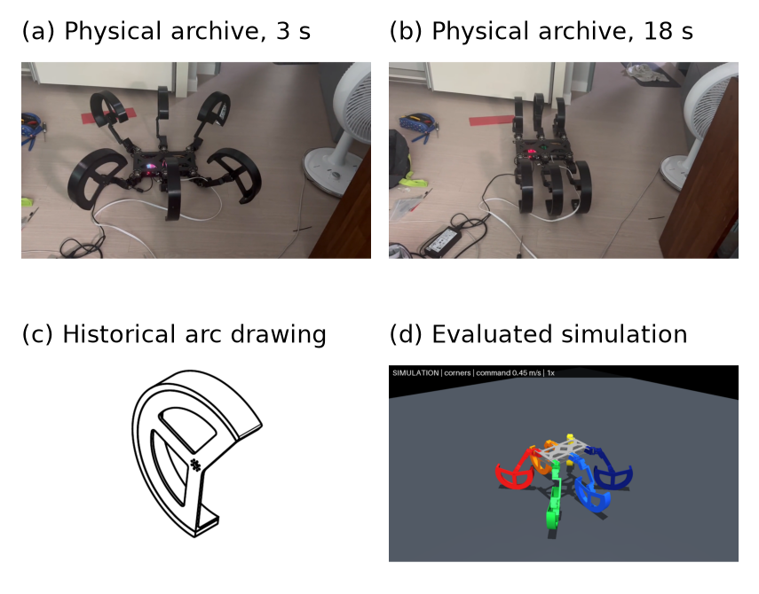
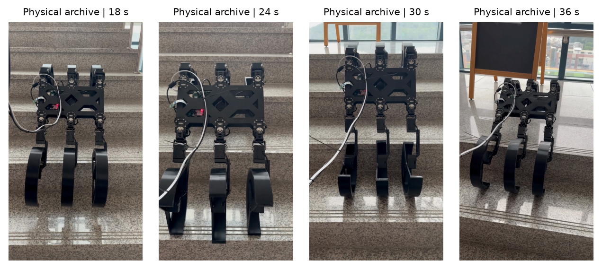

# SCONE 6족의 ICRA 2027 제출 검토

검토일: 2026-09-12 (한국 시간). 대상: 현재 SCONE 6족 코드·MuJoCo 모델·저장된 실험 자료·기존 ICRA 원고. MARC v4 4족은 후속 설계 상태만 확인했으며 이번 논문의 성능 근거로 사용하지 않았다.

이 문서는 저자 요청에 따른 **제출 전 모의 심사**다. 실제 ICRA 심사, 공식 판정 또는 채택 확률 예측이 아니다.

## 1. 현재 판정

**프로젝트에는 논문으로 발전시킬 구체적인 제어 아이디어가 있다. 그러나 기존 원고를 지금 그대로 제출할 준비는 되어 있지 않다.** 가장 방어하기 좋은 주제는 ‘관절형 부채꼴 다리에서 요구 접촉 이동량을 굴림과 관절 보행으로 나누고, 굴릴 수 있는 다리에만 그 역할을 맡기는 제어’다. 원래 원고의 ‘안쪽 개구부를 이용한 계단 걸림’은 현재 충돌 모델로 입증할 수 없다.

ICRA의 실제 평점 체계를 빌린 자체 판정은 **C- / 2.5, Reject에 가까움**이다. 이 평점의 이유는 영어 표현이나 프로젝트 규모가 아니라, 핵심 형상의 접촉 재현, 독립 검증 실험, 이번 제어기의 실물 반복 비교, 배포 가능한 실행 경로가 아직 부족하기 때문이다. 수정본은 이 한계를 밝히는 연구 초안이다. 실물 v2 영상과 제작 도면을 확인했으므로 물리 기체의 존재는 확인된다. 다만 그 기록이 이번 후보 제어기를 검증하지는 않는다.

수정 후에도 채택 가능성은 낮다고 판단하며 자체 C- 점수를 유지한다. 이는 보정된 확률값이 아니며 학회 전체 채택률을 개별 논문의 확률로 대입하지 않는다. 거절 판단을 바꿀 핵심 증거는 구성요소별 비교, 현재 제어기의 실물 데이터, 가까운 선행연구와의 실질적인 차이다. 상세 전후 비교는 `REVISION_NOTES_KO.md`에 있다.

| 평가 항목 | 판단 | 심사위원이 요구할 근거 |
|---|---|---|
| ICRA 주제 적합성 | 높음 | 다족 이동, 기구와 제어의 결합, 접촉 모델 |
| 구체적 기여 | 가능성 있음 | 유한 호의 굴림/보행 이동량 분배와 재인덱싱 |
| 독창성 | 아직 충분히 입증되지 않음 | 기존 이동 접촉·혼합 보행 제어와의 정확한 차이, 구성요소 ablation |
| 기술적 타당성 | 부분 검증 | 실제 접촉, 모터 추종, 기구 충돌, 하드스톱 |
| 실험 완성도 | 부족 | 동결된 평가 세트, 외란·다방향·수치 민감도·실물 반복 |
| 재현성 | 자료는 개선됨, 배포 경로 미완성 | 의존성 잠금, 완전한 익명 실행 묶음, 최신 후보의 CLI 연결 |
| 주장과 근거의 일치 | 기존 원고 수정 필요 | 예전 원시 기록과 현재 코드 결과를 구분 |

평점 체계 출처: [IEEE RAS ICRA reviewer guidelines](https://www.ieee-ras.org/conferences-workshops/fully-sponsored/icra/information-for-icra-reviewers/). 기술 판단은 이 저장소에 대한 이번 검토자의 판단이다.

## 2. ICRA 2027 최신 일정과 형식

2026-09-12에 확인한 [ICRA 2027 공식 Call for Papers](https://2027.ieee-icra.org/contribute/call-for-icra-2027-papers-now-accepting-submissions/) 기준이다.

| 항목 | 공식 안내 |
|---|---|
| 개최 | 2027-05-24~28, 서울 |
| 일반 논문 마감 | 2026-09-15 23:59 **PST** |
| 심사 결과 | 2027-01-31 |
| 분량 | 참고문헌·그림·표·감사의 글을 포함해 최대 8쪽 |
| 형식 | PDF, IEEE ICRA 2단, 이중 익명 심사 |
| 영상 재개 창 | 2026-09-17~22 23:59 PST; 9월 10~16일 업로드 중단 |
| 동반 영상 | 최대 180초·20 MB, mpeg/mp4/mpg, 높이 480 이상·20 fps 이상·progressive |
| 현장 발표 | 일반 논문은 현장 발표자 필요 |

PST를 문자 그대로 UTC-8로 해석하면 논문 마감은 **9월 16일 16:59 KST**다. 다만 9월 미국 태평양 지역은 일반적으로 PDT(UTC-7)를 쓰며, 그 의미라면 15:59 KST다. 공식 공지의 시간대 표기를 임의로 고치지 않는다. **내부 작업 마감은 9월 15일 23:59 KST 이전**으로 잡고 PaperPlaza 화면의 실제 마감을 최종 확인하는 편이 좋다. 이번 검토에서는 계정에 로그인해 제출 상태를 확인하거나 원고를 업로드하지 않았다.

공식 웹사이트에는 일반 논문의 현장 발표 원칙과 별도로 워크숍 원격 참여 안내가 함께 실려 있다. 일반 논문에 원격 발표가 허용된다고 해석하지 않았다. 최종 원고 마감은 RAS 심사위원 일정에 2027-03-06으로 표시되지만, 등록 마감과 혼동하지 말고 수락 후 저자 공지를 다시 확인해야 한다.

익명화는 저자·기관·지원기관·얼굴·로고·메타데이터뿐 아니라 널리 알려지지 않은 로봇의 고유 이름과 신원을 드러내는 외부 링크에도 적용된다. 그래서 영문 본문에서는 SCONE 대신 중립적인 플랫폼 표현과 모델 다리 ID를 썼다. 기존 공개 저장소를 비공개로 바꿀 의무를 여기서 새로 만들지는 않았다. 제출 자료의 링크는 익명화해야 한다. [IEEE RAS 익명 심사 규칙](https://www.ieee-ras.org/publications/rules-for-the-double-anonymous-review-process/)

이번 작업은 문장 교정을 넘어 원고·분석·실험 보조 코드 작성에 AI를 사용했다. 영문 초안에 시스템과 사용 범위를 밝히는 AI 사용 고지를 포함했다. 이 고지는 사람이나 지원기관을 밝히지 않는다. 실제 저자는 제출 전 내용과 참고문헌을 검증해야 한다. [IEEE RAS AI 사용 지침](https://www.ieee-ras.org/publications/guidelines-for-generative-ai-usage/)

## 3. 전체 프로젝트 검토 범위

107개 Python 파일, 총 33,072줄의 구문 분석으로 구조를 확인하고, 전체 모듈의 연결 관계를 목록화했다.  논문 주장과 연결되는 핵심 구현을 읽었으며, 전체 자동 테스트를 실행했다. CAD 원본 전부를 재해석하거나 실물 기체를 구동한 것은 아니다. ‘전체 검토’는 모든 소스 줄에 대한 형식 검증을 뜻하지 않는다.

| 영역 | 확인한 구현/자료 | 논문에서의 의미 |
|---|---|---|
| 하드웨어/공통 API | `src/main.py`, `src/hardware/`, `ControllerProtocol`, 혼합 DYNAMIXEL 통신 | 실물·시뮬레이션 경로가 있지만 실물 성능 검증은 별도 |
| 기구학 | `src/kinematics/`, `tripod_gait.py`, `sector_wheel.py` | 접점 기준, FK/IK, 회전축과 반경에 의한 굴림 방향 |
| 고전/혼합 보행 | `walk.py`, `drive.py`, `climb.py`, `scone_gait.py`, `scone_rolling_gait.py` | 서로 다른 제어 계열. 이름만 보고 성능을 합치면 안 됨 |
| 최신 역할 분배 | `scone_gait_v2.py`, 미추적 테스트, docs/28·29 | 이번 원고의 중심 후보. 공개 import와 benchmark 연결은 미완성 |
| 시뮬레이션/모터 | `model.xml`, `core/model.py`, `controller.py`, `pid.py`, `packages/dynamixel-mujoco` | DC 모터·반사 관성·PD·접촉을 포함하지만 실물 동정은 미완료 |
| 계단/지형 | `stair_climber.py`, `stair_demo.py`, `terrain/`, `benchmark/stairs.py` | 알려진 계단 치수를 쓰는 결정론적 제어; 지각 기반 자율성 아님 |
| 강화학습 | `walk_learn.py`, `walk_v2.py`, `walk_v3.py`, `walk_failsafe.py`, joystick/compat | 별개 학습 계열. 새 원고 실험에는 PPO를 사용하지 않음 |
| 원격 운영 | `remote_watch.py`, `inquiry.py` | 체크포인트 무결성과 재생 경로. 학습 성능 그 자체의 증거 아님 |
| 벤치마크 | `benchmark/common.py`, `controllers.py`, `icra.py`, `report.py`, `model_variants.py` | paired 프로토콜과 통계 출력은 존재. 최신 후보 통합과 모델 타당성은 별도 |
| 실험/영상 | `benchmark/results/`, `archive/simulation_media/`, `archive/videos/`, `archive/assets/`, `archive/papers/` | 예전 개발 기록, 실물 v1/v2, 포스터·도면 확인. 현재 논문 수치와 분리 |
| 기존 논문/이론 | `archive/ICRA/`, docs/16·25·26·28·29 | 과장·좌표 혼동·버전 혼용·실험 공백 점검 |
| 후속 설계 | docs/30, docs/reviews, artifacts/marc | MARC v4 4족 D0 계열. 6족 실험 근거에 합치지 않음 |

새 실험의 파일별 SHA-256, Git HEAD, dirty flag, 의존성 버전은 `evidence/audit_protocol.json`에 있다. 시작 당시 수정 중인 `src/locomotion/scone_gait_v2.py`와 기존 미추적 자료를 보존했다. 이번 작업은 새 `archive/ICRA_2027_20260912/` 안에만 원고·보고·검증 산출물을 추가한다. 기존 KSEF 계열 보고서의 정식 출판·DOI·심사된 proceedings 여부는 저장소로 확정하지 못했다. 실제 저자는 자기 선행 발표 이력을 확인해 중복 출판·익명 자기 인용을 처리해야 한다.

## 4. 제출을 막는 주요 발견

### P0. 시각 형상과 충돌 형상이 다르다

`src/assets/model.xml`의 각 TIRE는 단일 `type="mesh"` 충돌 geom이다. 로드 경로는 이를 여러 볼록 조각으로 분해하지 않고 SDF도 사용하지 않는다. MuJoCo의 일반 충돌 경로는 볼록 형상을 사용한다. 이번에 컴파일된 TIRE의 314개 정점으로 hull을 계산하자 부채꼴의 빈 중심이 내부로 판정됐다. 중심에 반경 1 mm 구를 둔 별도 최소 모델에서도 접촉 1개, 거리 약 -23 mm가 나왔다.

이는 ‘C자 안쪽 면에 계단 모서리가 들어가 걸린다’는 기전을 현재 모델이 검증하지 못한다는 직접적인 증거다. 개구 방향의 원형 cap까지 완전한 원으로 채우는 것은 아니므로 현재 proxy와 닫힌 원통을 같다고 말해서도 안 된다. 평면 지지에서는 볼록화가 support function을 보존하지만, 오목한 내부의 모서리 포획은 다른 문제다.

조치: 타이어를 적절한 볼록 조각 또는 검증된 비볼록 접촉 표현으로 만들고, 모서리 접근·포획·해제 과정을 단일 다리 시험에서 확인한 뒤 전체 계단 비교를 수행한다. 이번에는 모델을 바꾸지 않았으며, 원고에서 걸림 입증 주장을 제외했다.

근거: `evidence/geometry_audit.json`, `evidence/concavity_probe.json`, `src/assets/model.xml`, `src/simulation/core/model.py`; [MuJoCo 공식 충돌 설명](https://mujoco.readthedocs.io/en/stable/computation/index.html).

### P0. 최신 후보의 실행 연결이 끊겨 있다

전체 자동 테스트는 **260개 실행 항목 중 259개 통과, 1개 모듈 로드 오류**다. 실패 항목은 `tests/test_scone_gait_v2.py`이고, `src.locomotion`이 `LegRole`, `SconeGaitV2`, `SconeGaitV2Config`를 내보내지 않아 import가 실패한다. 따라서 그 파일 내부의 테스트들은 실행된 것으로 셀 수 없다.

또한 `benchmark/controllers.py::make_controller`는 `role-split-scone` 및 문서의 두 다리 비교 별칭을 지원하지 않는다. import만 고쳐도 해당 테스트 파일의 flat-ground 시험은 이 경로에서 다시 실패할 수 있다. 이번 새 실험은 후보 클래스를 직접 불러오는 별도 감사 runner를 사용했고, 메인 CLI가 이미 정상이라는 주장을 하지 않았다.

조치: export·factory·CLI·테스트를 하나의 실행 경로로 연결하고 전체 테스트를 다시 통과시킨다. 제어 코드 수정은 이번 원고 작성 작업에 포함하지 않았다. 근거: `evidence/full_tests.log`, `src/locomotion/__init__.py`, `benchmark/controllers.py`, `tests/test_scone_gait_v2.py:223`.

### P0. 예전 원고의 수치는 현재 코드의 결과가 아니다

기존 `flat-nominal.jsonl`, `stairs-nominal.jsonl`, `transitions-nominal.jsonl`에는 `git_revision=bb322369...`, `git_dirty=true`가 기록돼 있다. Git hash만으로 당시의 수정 파일 전체를 복구할 수 없다. 이후 모터 반사 관성과 damping 값 등도 바뀌었다. 예전 원고의 0.117/0.090/0.200 m/s를 현재 최신 후보의 성능처럼 재사용하면 안 된다.

새 결과는 별도 manifest와 원시 JSONL에 저장했다. 예전 값은 연구 경과 설명에만 남기고 새 논문의 핵심 표에는 넣지 않았다. 체크포인트나 CAD 후속 설계의 수치도 합치지 않았다.

### P1. 기존 matched 프로토콜의 비교 대상과 초기화가 문제다

세 matched 조건에는 stagger 자세를 planner nominal로 다시 등록하는 코드가 남아 있다. `docs/25`에 기록된 초기화 문제를 현재 소스에서도 확인했다. 원래의 matched suite는 예전 `RollGait` 계열을 비교하며, 최신 역할 분배 후보는 포함하지 않는다. 이 suite를 실행하는 것만으로 새 논문을 검증했다고 할 수 없다.

이번 별도 6초 재실행(0.18 m/s, 초기 위상 0)에서는 다음 순전방 속도를 얻었다. 이것도 개발 진단이며 새 역할 분배 80회 표에 합치지 않았다.

| 기존 adapter | 현재 재실행 속도 (m/s) |
|---|---:|
| articulated-walk | 0.111202 |
| distal-only-roll | 0.091326 |
| full-roll | 0.201268 |
| matched-articulated | 0.001295 |
| matched-distal-only | 0.000666 |
| matched-coordinated | 0.053898 |

공정한 baseline을 ‘최소 속도 이상 나와야 통과’로 정의하지 않는다. baseline이 느릴 수는 있지만, 올바르게 구현됐는지와 동일한 자원 제약 아래 합리적으로 설정됐는지를 먼저 확인해야 한다. 원하는 순서가 나올 때까지 baseline을 수정하면 안 된다. 이번에는 동일 scheduler의 rolling 허용 집합을 바꾸는 비교를 중심에 두고, 별도 tripod는 보조 대조군으로 밝혔다.

### P1. 물리적 안정성과 효율을 과장할 여지가 있다

18개 hinge 모두 물리적 hard-stop 제한이 없다. 타이어와 상·하부 몸체 이외의 많은 부품은 충돌이 꺼져 있다. 따라서 forbidden collision 0은 전체 링크·다리 간섭 0이라는 뜻이 아니다. 세 다리를 stance로 계획한 것도 실제 세 다리가 하중을 받는다는 보장은 아니다.

모터 saturation은 stall 수준이며 연속 열한계가 아니다. `W_abs`는 절대 관절 기계일이고 배터리 에너지가 아니다. `C_mt`의 분모는 순수 전방 거리가 아니라 평면 순변위라 횡방향 이동의 영향을 받는다. slip은 하중 가중치가 없는 접촉점 평균이다. 이번 원고는 이 정의를 공개하고 ‘효율적’이라는 포괄적 결론 대신 지표별 결과를 기술한다.

### P1. RL 구현과 RL 성능의 증거를 구분해야 한다

walk-v3는 76차원 관측과 18개 action을 사용하는 residual PPO 계열이고, baseline 비교 및 promotion gate 관련 수정이 있다. 그러나 코드 존재·테스트 통과·체크포인트 저장만으로 최신 정책의 우수성을 입증할 수 없다. 이번 작업에서는 원격 학습이나 실물 구동을 하지 않았고 최신 정책의 고정 평가 세트를 검증하지 않았다. PPO 결과를 새 논문의 기여로 넣지 않았다. 추후 넣으려면 zero-residual과 동일한 명령·지형·동역학에서 비교해야 한다.

### P1. 기존 시뮬레이션 영상과 실물 원본의 규격은 다르다

기존 시뮬레이션 capture manifest는 **640×360, 15 fps**로 최소 규격에 미달했다. 반면 실물 v2 영상은 **1280×720, 30 fps**, 계단 영상은 **1080×1920, 30 fps**였다. 모든 영상이 규격 미달이라는 판단은 수정했다. 이번에는 현재 모델에서 N/P12/C를 **1280×720, 25 fps**로 직접 다시 촬영하고, phase=0의 원래 속도와 일치함을 확인했다. 옛 저해상도 영상을 확대해 새 실험으로 표시하지 않았다.

동반 영상 초안은 외부 케이블이 보이는 실물 자료와 새 시뮬레이션을 구분한다. 배속은 1배, 음성은 제외하며 명령 속도와 시뮬레이션 시간을 표시했다. 실물 기록을 새로운 제어기의 정량 검증으로 사용하지 않는다.

## 5. 새로 수행한 수치 검토

`evidence/run_audit.py`는 실물 인터페이스를 열지 않고 fresh MuJoCo 모델을 만든다. 2개 전진 명령 × 초기 위상 8개 × 5개 조건, 총 80개 시행을 사전에 정했다. 각 시행은 초기화 후 1초 중립 정착과 8초 측정이다. 물리 2 ms, 제어 20 ms, 동일 standard pose·전압/토크 제한·모터 설정을 사용한다.

위상 8개는 결정론적 격자다. 8대의 로봇 또는 8개의 독립 무작위 지형을 의미하지 않는다. 보고하는 범위는 최솟값~최댓값이며 모집단 신뢰구간·성공 확률이 아니다. 파라미터는 실행 중 재튜닝하지 않았다. 실험 전 고정한 설정은 이번 개발 검토의 재현성을 높이지만 이미 개발에 이용된 명령 범위이므로 held-out evaluation으로 부르지 않는다.

| 조건 | 0.18 명령 속도 평균 [범위] | 0.45 명령 속도 평균 [범위] |
|---|---:|---:|
| 굴림 off, 동일 scheduler | 0.0931 [0.0911, 0.0948] | 0.1375 [0.1339, 0.1398] |
| 1·2번만 굴림 | 0.1085 [0.1069, 0.1107] | 0.2775 [0.2625, 0.2891] |
| 5·6번만 굴림 | 0.1029 [0.1004, 0.1044] | 0.1627 [0.1567, 0.1700] |
| 네 모서리 굴림 | 0.1157 [0.1142, 0.1177] | 0.2852 [0.2825, 0.2876] |
| 동일 cadence·stride tripod | 0.0477 [0.0474, 0.0481] | 0.1329 [0.1194, 0.1381] |

속도 단위는 m/s이며 순전방 변위를 측정 시간으로 나눈 값이다.

| 조건 (0.45 명령) | RMSE (m/s) | 절대 기계일 (J) | 기계 COT | slip (m) |
|---|---:|---:|---:|---:|
| 굴림 off, 동일 scheduler | 0.318 | 57.331 | 1.277 | 0.383 |
| 1·2번만 굴림 | 0.189 | 91.037 | 1.004 | 0.581 |
| 5·6번만 굴림 | 0.299 | 69.160 | 1.299 | 0.528 |
| 네 모서리 굴림 | 0.188 | 89.325 | 0.958 | 0.630 |
| 동일 cadence·stride tripod | 0.324 | 64.752 | 1.500 | 0.456 |

총 80개 시행은 모두 8초 구간을 완료했다. IK 실패 프레임 0개, 기록된 금지 몸체 접촉 0개, 최소 upright 0.99921였다. 별도 MuJoCo 속도 적분 진단과 변위 속도의 최대 차이는 0.0023 m/s였다. 1·2번 구성은 네 모서리 구성 속도의 97.3%지만, 이것이 같은 효율·안정성이나 2모터 로봇을 뜻하지 않는다.

부채꼴 각도에 따른 기하 접점 확인은 6개 다리 × 21개 각도, 총 126개 표본이다. standard 기준 각도 창은 모두 -100~+100도, 접점 중심 이동 최대값은 수평 2.828 mm·수직 0.053 mm였다. 이 값은 소스 주석의 0.7 mm보다 큰 이번 측정값이며, 정확한 접점 불변성이 아닌 근사적 성질로 논문에 기술했다.

### 추가 시간 간격 검사

주 비교 이후 초기 위상 0에서 N/P12/C를 1·2·4 ms로 재실행한 9회 추가 진단을 수행했다. 2 ms 대비 속도 차이는 최대 0.00085 m/s 미만이었다. 이것은 단일 위상 평지의 수치 민감도 확인이며, 원래 80회에 독립 표본으로 더하지 않는다. 같은 조건을 새 카메라로 재생한 3회 역시 별도 새 실험 성과로 세지 않는다.

| 조건 | 1 ms 속도 | 2 ms 속도 | 4 ms 속도 |
|---|---:|---:|---:|
| N | 0.136073 | 0.135654 | 0.135065 |
| P12 | 0.289009 | 0.289106 | 0.288263 |
| C | 0.283067 | 0.282817 | 0.282453 |

단위는 m/s. 이 위상에서는 P12가 C보다 조금 빠르지만 여덟 위상 평균에서는 C가 빠르다. 대표 영상 한 개로 평균 비교를 대신하지 않았다.

## 6. 모의 심사 의견

### 주 기여에 대한 의견

하나의 요구 접촉 이동량을 굴림과 관절 성분으로 나누는 구현은 단순한 모드 추가보다 논문으로 설명하기 좋다. 회전축×반경으로 재료점 속도를 구하고, 최저 기하 접점의 차분과 구별하는 설명도 명확하다. 유한 호의 각도 여유, 역할 변경 시점, 재인덱싱을 함께 다루는 것은 플랫폼의 제약에 직접 연결된다.

다만 벡터 투영 자체는 새로운 수학이 아니다. 단순 분배 규칙의 적용을 넘는 기여는 유한 호 때문에 생기는 실패를 실제로 해결하는지, 같은 조건에서 구동 다리 선택이 재현 가능한 이점을 주는지로 입증해야 한다. 전신 MPC 또는 기존 hybrid planner에 대한 성능 우월성은 현재 비교에서 나오지 않는다.

### 주요 수정 요구

1. 실제 형상의 내부 접촉을 재현하는 단일 다리 검증을 먼저 제시하라. 지금은 계단 걸림이라는 핵심 기전을 모델이 표현하지 못한다.
2. 전체 역할 분배, 이동량 차감, lift-off에서의 steering latch, reindexing을 각각 제거한 실험으로 어떤 부분이 필요한지 밝혀라. 현재 rolling subset 비교는 여러 동작을 함께 바꾼다.
3. 초기 위상 외에 명령 변화, 외란, 마찰·질량·모터 변화와 접촉 수치 민감도를 검증하라. 단일 위상의 timestep 검사는 이번에 추가됐다. 성공한 8초 전진을 장시간 안전·다방향 주행으로 일반화하지 말라.
4. 기계일 증가와 순변위당 비용 감소를 구분하고, 횡이동·yaw·실제 loaded support를 함께 제시하라.
5. 코드와 익명 실행 자료를 하나의 동결본으로 제공하라. 모듈 로드에 실패하는 상태에서 재현 가능성을 완료형으로 주장하지 말라.
6. 가능하면 실물에서 적어도 평지 대조군과 제안 제어의 반복 비교를 제공하라. ICRA가 모든 시뮬레이션 논문에 하드웨어를 의무화한다는 뜻은 아니지만, 물리 기구의 장점을 주장하는 본 연구에서는 설득력이 크게 달라진다.

### 저자에게 남기는 핵심 질문

- 굴림 각도의 ‘실현값’은 명령상 포화된 각도인가, 엔코더로 실제 측정한 각도인가? 현재 구현은 전자다.
- 모든 지지 다리가 stance로 예약되어 있어도 하중이 사라질 때 어떻게 대처하는가?
- 실제 관절 hard-stop과 다리 간섭을 적용하면 지금의 조향·재인덱싱 창이 남는가?
- 2개 다리의 굴림 효과는 다른 다리의 보행 제동을 줄이는 것인지, 추가 추진력을 만드는 것인지?
- 타이어를 올바르게 분해한 뒤에도 같은 성능 순서가 유지되는가?

## 7. 새 논문의 구성과 기존 원고에서 바꾼 점

영문 제목: **Task-Space Travel Allocation for an Articulated Arc-Leg Hexapod**.
한국어 의미: **관절형 부채꼴 다리 6족 로봇의 작업 공간 이동량 분배**.

새 원고는 초록, 서론, 관련 연구, 플랫폼/접촉 모델, 제어 방법, 실험 방법, 결과, 논의, 결론, AI 사용 고지, 참고문헌을 갖춘 IEEE 2단 원고다. 예전 원고를 덮어쓰지 않고 별도 폴더에 작성했다.

- 6족·18축 플랫폼과 최신 역할 분배 후보를 중심으로 썼다.
- 고유 이름·저자·기관 링크를 본문에서 제거했다.
- 실험 데이터에서 자동 생성한 표와 그림을 사용했다.
- 예전 single-run 결과를 새로운 통계처럼 쓰지 않았다.
- 계단 걸림, 실물 우수성, PPO 성능, 에너지 효율의 과장된 주장을 제거했다.
- 평균 순변위 속도와 peak speed를 구분하고 RMSE·기계일·slip·yaw를 함께 보고했다.
- 모든 한계를 별도 README에만 숨기지 않고 본문에도 명시했다.
- 실물 두 자세·역사적 도면·현재 모델, 계단 네 프레임, N/P12/C의 아홉 재생 화면을 포함한 6개 그림과 15개 참고문헌으로 수정했다.
- 최근접 R-Taichi 2025와 stride-level 2026 연구를 반영하여 actuator reuse나 stride-level hybrid 자체를 독창성으로 주장하지 않았다.
- 포스터의 v2 0.7/2.0 m/s와 이전 보고서의 0.5/0.7 m/s는 원시 측정 조건을 검증하지 못해 새 결과로 가져오지 않았다.
- 2024 도면의 148.27° 표기와 docs/26의 개구부 135°를 동일한 형상·각도 정의로 단정하지 않았다. 핵심 실험은 실제 compiled mesh를 사용한다.

실물 자료는 원본 영상의 3·18초, 도면은 식별 제목란을 제외한 상세다. 시뮬레이션 패널은 현재 후보를 실제 렌더링했다.

원본 18·24·30·36초. 역사적 정성 자료이며 새 제어기의 실물 검증이 아니다. 원본 해시·타임코드와 참고문헌 검토 수준은 `media_manifest.json`, `REFERENCES_KO.md`를 참조한다.

## 8. 제출까지의 우선순위

| 순서 | 해야 할 일 | 완료 판단 |
|---|---|---|
| 1 | 원고를 실제 저자가 읽고 연구 기여·실물 상태 확인 | 모든 수식·참고문헌·표·그림의 책임 검토 |
| 2 | 최신 후보 export/factory/CLI 경로 연결 | 기존 실패와 후보 파일 내부 테스트 모두 통과 |
| 3 | contact geometry와 기구 제한 검증 | 빈 공간 probe, 모서리 접촉, 링크 간섭, hard-stop 시험 |
| 4 | source/dependencies 동결 후 파일럿 | 잘못된 baseline 초기화 없이 전체 비교 실행 |
| 5 | disjoint 평가와 수치/외란 시험 | 사전 정의된 전 조건·실패·범위 보고, 유리한 결과만 선택하지 않음 |
| 6 | 실물 또는 더 강한 시뮬레이션 검증 | 주장과 같은 계층의 증거 확보 |
| 7 | 촬영된 영상의 내용·익명화·업로드 검증 | 새 720p/25 fps 영상 완성. 실제 PaperPlaza 체크는 남음 |

마감 직전 시간이 부족하다는 이유로 입증되지 않은 수치를 채워 넣거나 실패 조건을 숨기면 안 된다. 현재 영문 원고는 검토 가능한 연구 초안까지 작성되어 있다. 위의 실험·통합 공백이 남은 상태를 ‘제출 준비 완료’라고 보고하지 않는다.

## 9. 참고문헌과 확인 범위

수정본은 15개 문헌을 사용한다. Quattroped/TurboQuad, RHex 기구학 2024, Rolling vs. Swing 2025, stride-level hybrid 2026, RL-augmented MPC 2026을 추가했다. 각 문헌의 주장 연결, 원문 검토 수준과 DOI 확인 내역은 `REFERENCES_KO.md`에 있다. Chang & Lin의 2026 연구는 저자 목록·출판사 등록 초록까지 확인했으며 전문의 수식/실험 대조는 남아 있다. Patrizi 연구는 RA-L 출판 정보를 확인하여 최종 저널 서지로 인용했다.

새 원고에는 원문·저자/기관 자료·출판사 페이지로 확인한 RHex, Q-Whex, C-legged 에너지 분석, ASTERISK H, Keep Rollin', Whole-Body MPC, MuJoCo 자료를 인용했다. 최근 자료인 ATRos는 **2025 preprint / workshop 제출 이력**으로 표시했으며 정식 ICRA/IROS 채택 논문으로 꾸미지 않았다.

- [RHex, 저자/기관 원문 정보](https://publications.ri.cmu.edu/rhex-a-simple-and-highly-mobile-hexapod-robot)
- [Q-Whex, 출판사](https://onlinelibrary.wiley.com/doi/full/10.1002/rob.22186)
- [C-Legged 에너지 분석, 출판사](https://www.mdpi.com/2076-3417/11/6/2513)
- [ASTERISK H, 출판사 원문](https://www.fujipress.jp/main/wp-content/themes/Fujipress/phyosetsu.php?ppno=ROBOT002000030007)
- [Keep Rollin', 저자 원고](https://arxiv.org/abs/1809.03557)
- [Whole-Body MPC, 저자 원고](https://arxiv.org/abs/2010.06322)
- [ATRos, 2025 preprint](https://arxiv.org/abs/2510.09980)
- [MuJoCo 원 논문](https://homes.cs.washington.edu/~todorov/papers/TodorovIROS12.pdf)

최신 문헌을 전수 조사해 ‘유사 연구가 없다’고 증명한 것은 아니다. 독창성은 이 구체적 기구와 유한 호 제약 아래 무엇을 새로 검증하는지로 제시해야 한다.
