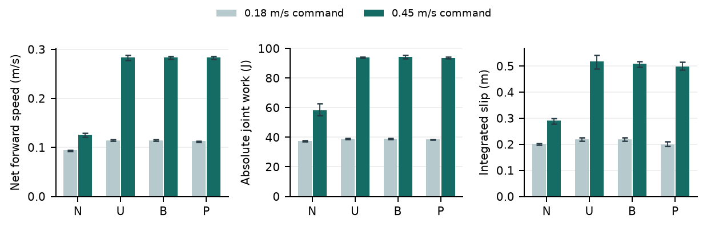

# SCONE ICRA 2027 재검토

## 판단과 제출 전략

이번 개정은 표현을 고치는 데서 그치지 않고, 제어기에 되감기 제약과 다음 스윙 시점까지의 회전 소모 예측을 적용하고, 실제 충돌 모델과 재현 실행 경로를 개선했다. 영문 원고의 중심은 **Rewind-Budgeted Contact-Travel Allocation for an Articulated Arc-Leg Hexapod**이다. SCONE 6족 프로젝트만 다루며 MARC v4 4족 설계 및 검증되지 않은 RL 성능은 결과에 포함하지 않았다.

채택 가능성은 이전보다 설득할 근거가 늘었지만, 아직 채택이 우세하다고 판단하기 어렵다. 공식 ICRA 등급에 비추어 본 내부 모의 평가의 중심은 **C(3.0)**이다. 이전 원고의 C-(2.5)보다 재현성과 기여의 정의가 개선되었지만, 실제 심사 결과를 예측하는 통계 모델이나 동일 분야의 보정 자료는 없다. 따라서 개별 채택 확률을 숫자로 제시하지 않는다. 이는 실제 ICRA 심사위원의 판정이 아닌 제출 전 검토 의견이다.

[ICRA 심사 기준](https://www.ieee-ras.org/conferences-workshops/fully-sponsored/icra/information-for-icra-reviewers/)에 비추어 남는 핵심 문제는 제안 제어기의 정량 실물 검증과 근접 연구 대비 충분한 차별성이다. 그림과 문체의 완성도가 이 두 문제를 대신하지는 않는다.

## 프로젝트 전체에서 채택에 연결한 개선

| 검토 영역 | 확인한 문제 | 적용 및 논문 반영 |
|---|---|---|
| 기구·CAD·제작 자료 | 실물 SCONE, 시뮬레이션 모델, 과거 도면과 MARC 설계가 혼재 | 논문 대상을 18개 관절의 SCONE 6족으로 고정. 과거 도면과 실물 영상은 해당 세대의 정성 자료로만 사용 |
| 운동학·제어 | 접지 회전 속도만 제한하면 스윙 되감기의 최대 속도가 커질 수 있음 | 5차 보간의 최대 기울기에서 되감기 각도 한도 57.6도를 유도하고, 명령 단계별 회전량 제한 적용 |
| 스윙 계획 | 각도만 제한하고 스윙을 미루면 남는 이동량이 관절의 도달 범위를 넘음 | 다음 스윙 기회까지의 회전량을 예측해 선제적으로 재인덱싱. 예측이 없는 G를 독립 비교 조건으로 유지 |
| 충돌 모델 | 타이어를 하나의 볼록 껍질로 처리해 내부 빈 공간이 막힘 | CoACD 24조각/타이어 모델 추가. 1 mm 구체의 축 중심 접촉이 1건에서 0건으로 바뀜. 질량·관성 동일성 확인 |
| 패키지·비교 실험 | 새 제어기가 공개 내보내기와 공통 비교 경로에 일관되게 연결되지 않음 | 클래스 내보내기와 공통 제어기 생성 경로 추가. 새 옵션은 시뮬레이션 실험 경로에서 명시적으로 선택 |
| 테스트 | 기존 전체 테스트에서 클래스 가져오기 오류 발생 | 기존 15개 제어기 테스트를 포함해 최종 전체 279개 통과. 회전 제약·정지/재개·충돌 내부 공간·고속 선제 스윙 회귀 검증 추가 |
| 재현성 | 개발 중인 작업 폴더에서 나온 수치를 제출 성능처럼 읽을 위험 | 원래 작업 폴더는 보존하고 별도 소스 스냅샷을 커밋. 최종 확인 실험의 소스 해시·설정·원자료·번들 보관 |
| RL·학습 기록 | 체크포인트 및 과거 보상값을 새 제어기 검증으로 혼용할 위험 | 새 원고는 비학습 기하학 제어의 결과로 한정. RL이 포함된 것처럼 서술하지 않음 |
| 영상·문헌·글쓰기 | 과거 실물 영상과 새 시뮬레이션 사이의 구분이 약함 | 원본 프레임 출처·시각·조건 표기, 새 비교 영상, ICRA 전문을 참고한 영문 서술, DOI 기반 참고문헌 정리 |

## 새 실험 결과

최종 확인 시험은 268개이며, 193개가 완료되고 75개가 IK 목표 거부로 종료되었다. 실패는 주로 의도적으로 기능을 제거한 대조군에 발생했다. 제안 방식 B는 해당 시험 **68/68개를 완료**했고 sector 변화율 제한을 넘는 프레임은 없었다. 전체 완료 수를 제안 방식의 성공률처럼 사용하지 않는다.

| 핵심 비교: 전진 명령 0.45 m/s | 측정값 |
|---|---|
| B 평균 순이동 속도 | 0.283 m/s |
| 굴림을 제거한 N 평균 속도 | 0.126 m/s |
| B/N 속도 비율 | 2.25배 |
| 기존 U 속도 대비 B | 99.95% 유지 |
| U → B 최대 sector 명령 변화율 | 1516.8 → 536.4 도/초 |
| B-N 위상별 속도 차이 | 평균 0.157, 범위 0.151~0.162 m/s |

각도 한도만 추가한 G는 낮은 명령의 8개 시험을 모두 완료했지만 높은 명령에서는 8개 모두 실패했다. 다음 스윙 기회까지의 소모량을 예측한 B는 이 문제를 해결했다. 주기적으로 스윙하는 P도 전진 시험을 모두 완료하고 고속에서는 B와 거의 같은 성능을 냈다. 따라서 적응형 재인덱싱이 주기형보다 우월하다고 결론내리지 않는다.

B의 최대 합산 distal 목표 변화율은 1594.6 도/초였다. sector 제약만으로 모터 전체가 제한되었다고 말할 수 없다. 전진 시험 중 실제 하중 접촉 다리 수는 순간적으로 1개까지 내려갔고, 3개 미만인 샘플 비율은 최대 11.65%였다.

수치의 의미는 **같은 기구와 제어 경로에서 sector 명령의 되감기 제약을 지키면서 이동 성능을 유지했다**는 것이다. 명령 속도 0.45 m/s를 정확히 추종한 결과나 배터리 효율 개선으로 표현하지 않는다. 관절 보행과 합산한 최종 distal 목표의 변화율은 sector 변화율보다 높을 수 있으며, 실제 구동기 전체의 속도 제한까지 보장하지 않는다.

순간적으로 3개보다 적은 다리가 하중을 받는 경우도 관측되었다. 본문의 “tripod schedule”은 3개 실제 접촉이나 정적 안정성 보장이 아니다. 접촉력 1 N 기준과 낮은 하중 접촉 비율을 결과에서 별도로 설명했다.

## 개발 실패와 확인 실험을 구분한 이유

첫 실행에서는 단순 중첩 방식의 IK 실패가 실험 프로그램 전체를 중단시켰다. 이를 정상적인 시험 실패로 기록하도록 측정 프로그램을 수정했다. 제어기나 평가 조건을 바꾸어 실패를 숨기지 않았다.

그 뒤 252개 개발 시험에서 각도만 제한한 방식이 고속 전진에 실패함을 확인했다. 선제적 재인덱싱을 추가하고, 기존 방식은 G로 남겼다. 최종 확인 실험은 G의 16개 사례를 추가한 268개 사전 고정 행렬이다. 원자료에는 개발 시험과 확인 시험이 별도 폴더로 보존되어 있으며, 논문 표에는 확인 시험만 집계했다. 최종 실험은 독립 미공개 테스트 집합이 아니라, 개발 후 고정된 소스에서 수행한 확인 실험이라고 명시했다.

모든 조건은 같은 초기 자세, 제어 게인, 명령 필터, 질량 및 타이어 형태를 사용한다. G와 S처럼 일부 또는 전부 실패한 조건은 완료율로 표시하며, 실패 전 짧은 구간의 평균 속도를 8초 성능으로 제시하지 않았다. 고정 위상을 확률 표본처럼 취급하지 않고 관측 범위를 제시했다.

## 심사위원이 여전히 물을 내용

| 중요도 | 예상 질문 | 현재 근거와 남는 일 |
|---|---|---|
| 가장 큼 | 이미 알려진 hybrid leg-wheel 연구보다 무엇이 충분히 새로운가? | 되감기 각도·시점·잔여 접촉 이동량을 결합한 기여는 구체화됨. Chang & Lin의 stride-level hybrid 연구 전문과 수식 비교는 아직 필요 |
| 가장 큼 | 제안 제어기가 실물에서도 작동하는가? | 과거 SCONE 실물 자료는 존재하지만 새 B 제어기의 실물 로그는 없음. 동기화된 B/U/N 실험이 필요 |
| 큼 | sector 속도만 제한해서 실제 모터에 도움이 되는가? | sector 변화율의 감소는 검증됨. IK와 합산한 관절 목표는 더 빠를 수 있으므로 모터 수준 제약·실제 추종 오차를 측정해야 함 |
| 큼 | 주기적 재인덱싱만으로 충분하지 않은가? | P도 주요 시험을 모두 완료하고 고속 성능은 B와 유사함. 적응형 스케줄이 우월하다고 주장하지 않음. 다양한 저속·전환 조건에서의 추가 가치가 필요 |
| 중간 | 시뮬레이션의 실물 충실도가 충분한가? | 내부 빈 공간과 외부 지지 형상은 확인. TPU 변형·마찰·온도·배터리·모든 링크 충돌·하드 스톱은 미검증 |
| 중간 | 계단 영상이 논문의 주장을 직접 지지하는가? | 물리 기구의 존재와 정성 움직임만 지지함. 새 제어기 또는 열린 호의 계단 우월성에 대한 비교 근거는 아님 |

이 중 실제 데이터를 새로 만들지 않고 해결할 수 있었던 사항은 이번에 적용했다. 실물 실험은 실행 가능한 계획과 기록 양식을 함께 만들었으며, 이 세션에서는 로봇에 명령을 보내거나 과거 기록을 새 실험으로 바꾸지 않았다.

## 실물 검증의 우선순위

첫 번째는 타이어와 관절의 실제 허용 속도·가동 범위를 확인하고, 합산 관절 목표를 그 범위 안에 두는 것이다. 현재 540도/초는 모델 실험의 sector 설정값이며 확인된 하드웨어 한계가 아니다. 동일한 바닥·전원·하중에서 B/U/N을 비교하고, 외부 위치 측정과 관절 위치·속도·전류를 같은 시간축에 기록해야 한다.

두 번째는 달성 가능한 저속부터 비교를 시작해, 거리당 전기에너지와 관절 추종 오차를 얻는 것이다. 에너지 분석에는 전압과 전류의 동시 측정이 필요하다. 전류 추정치나 절대 기계적 일을 배터리 에너지로 대체하지 않는다.

세 번째는 계단을 별도 연구 질문으로 다루는 것이다. 실제 접촉 사건을 확인하고 같은 외형·관성·구동 예산을 갖는 닫힌 바퀴 대조군과 비교해야 열린 내부 공간의 효과를 말할 수 있다. 현재 논문 제출 직전에 검증되지 않은 계단 최대 높이를 추가하는 것은 권하지 않는다.

구체적인 표준 기록 항목과 실행 순서는 함께 제공한 `HARDWARE_VALIDATION_KO.md`에 있다.

<!-- pagebreak -->

## ICRA 2027 현재 일정과 제출 상태

[공식 Call for Technical Papers](https://2027.ieee-icra.org/contribute/call-for-icra-2027-papers-now-accepting-submissions/)를 2026-09-12 확인했다. 이 보고서의 최종 생성일은 한국 시각 2026-09-13이다. 학회는 2027년 5월 24~28일 서울에서 열린다. 원고 마감은 2026년 9월 15일 23:59 PST로 표기되어 있다. 문자 그대로 PST를 적용하면 한국 시각 9월 16일 16:59이며, 서머타임 해석의 혼선을 피하려면 한국 시각 9월 15일 안에 제출을 끝내는 내부 일정을 권한다.

원고는 참고문헌을 포함해 최대 8쪽, IEEE 2단 형식, 이중 익명 심사다. 영상 업로드는 9월 10~16일 차단되며 9월 17~22일 다시 가능하다. 영상은 3분·20 MB 이내, 최소 480줄·20 fps의 순차주사 조건을 맞춰 준비했다. 원고 업로드와 영상 업로드 기간을 혼동하지 않아야 한다. 심사 결과 예정일은 2027년 1월 31일이다.

자동 생성된 원고는 저자의 사실·저자정보·기존 발표 이력 최종 확인이 필요하다. 과거 KSEF 문서의 정식 출판 여부 및 익명화 여부를 이 세션의 자료만으로 확정하지 않았다. 정식 ICRA 제출이나 외부 공개는 수행하지 않았다. 내부 검토 자료·소스 번들을 투고 원고에 함께 올리는 것도 의도하지 않는다.

## 전달 파일과 확인 범위

영문 PDF는 논문 본문, 한글 PDF는 이 내부 심사 검토다. 수정 가능한 LaTeX 원고와 참고문헌, 문체 적용 기록, 직접 렌더링한 시뮬레이션 영상, 과거 실물 장면을 포함한 동영상, 원자료와 소스 스냅샷을 함께 보관했다. 이전 원고 폴더는 그대로 유지했다.

원고의 사진은 원본 프로젝트 자료에서 가져왔고, 새 시뮬레이션 캡처는 실제 MuJoCo 실행 화면이다. 수치·기구 사진·계단 장면을 생성형 이미지로 만들어 실험처럼 제시하지 않았다. 최종 PDF는 렌더링한 각 페이지를 확인하고 글자 겹침·잘림·참고문헌 오류를 점검했다.
