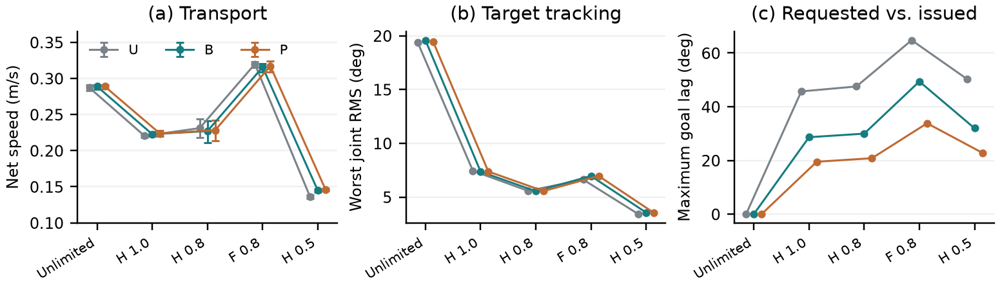

# SCONE 논문 재평가

2026-09-13 | Revision 4 | SCONE 6족 모델

## 최종 판정: 68/100, C(3.0)

원고와 검증을 개선했지만, 현재도 채택보다 거절 쪽으로 기운다. 전체 관절 명령 제한과 긴 실행을 실제로 추가한 점은 진전이다. 그러나 제안 B가 단순 주기형 P보다 필요하다는 근거와 정량 실물 검증이 아직 부족하다. 서식의 완성도를 연구 기여의 강도와 혼동하지 않았다.

이 100점 표는 동일한 자체 가중표를 사용한 모의 평가다. 공식 ICRA 총점이나 채택 확률이 아니며 외부 심사자가 평가한 결과도 아니다. 공식 공개 등급의 C(3.0)는 Low Borderline, 거절 쪽 경계선에 해당한다. 점수를 68%의 채택 확률로 읽으면 안 된다. 보정 가능한 외부 심사 자료가 없어 수치 확률은 계산하지 않았다.

| 항목 | 배점 | 이전 | 수정 후 | 판단 근거 |
|---|---|---|---|---|
| 독창성 | 25 | 12 | 12 | 가까운 혼합 이동 연구 대비 충분한 차별성은 미해결. 일반 속도 제한기를 새 이론으로 주장하지 않음 |
| 연구의 중요성 | 20 | 12 | 12 | 목표 제한의 실제 영향을 확인했지만 단순 대안보다 우월하지 않고 실물 이득은 미검증 |
| 기술적 타당성 | 20 | 16 | 17 | 합산 후 18관절 명령과 내부 보간에 제한을 구현·검증. 실제 관절·접촉 한계는 분리 |
| 실험의 설득력 | 20 | 11 | 14 | 새 위상, 176개 고정 시험, 전환·60초·시간 간격 점검과 원자료 보존 |
| 전달력·서식 | 10 | 9 | 9 | 공식 2단 형식, 핵심 비교표와 새 시뮬레이션 그림·영상. 이전 높은 점수를 유지 |
| 재현성 | 5 | 4 | 4 | 새 고정 소스와 프로토콜·원자료·검증 기록. 익명 외부 재현 경로는 별도 |
| 총점 | 100 | 64 | 68 | 근거가 강화된 범위만 4점 반영. 최종 권고 C는 유지 |

## 짧게 읽는 심사위원의 핵심 질문

문제는 의미가 있다. 유한한 호는 다음 접촉 전에 되감아야 하므로 기하학적 회전 범위와 시간상 허용 범위가 다르다. 하지만 좋은 되감기 수식을 넣었다는 사실만으로 새로운 연구 기여가 충분해지지는 않는다. “왜 더 단순한 주기형이 아닌가”, “IK까지 합친 전체 목표를 제한하면 무엇이 남는가”에 답해야 한다.

이번 시험은 두 번째 질문에 직접 답한다. 전체 목표 제한은 구현할 수 있지만, 보행 시간을 늦추거나 요청 궤적을 바꾸는 비용이 생긴다. 첫 번째 질문에는 아직 우월성을 답할 수 없다. 따라서 논문의 주장은 적응형의 우월성이 아니라 되감기 시간·잔여 이동량·목표 발행 방식의 결합과 그 제약으로 좁혔다.

<!-- pagebreak -->

## 필요한 보강과 실제 적용 상태

| 필요 근거 | 적용한 개선 | 현재 판단 |
|---|---|---|
| 전체 관절의 명령 제한 | IK+sector 합산 후 정수 위치 18개를 제한하고 내부 속도 프로파일도 제한 | 명령 수준 해결. 실제 속도·가속도·접촉 보장은 아님 |
| 공정하고 강한 단순 비교 | U/B/P 모두 같은 제한과 보행 시계 정책 적용 | 비교 완료. P보다 좋은 복잡한 B라는 주장은 불가 |
| 짧은 일정 주행 밖의 검증 | 20초 기본, 24초 명령 전환, 60초 실행, 새 위상 4개 | 정해진 범위 완료. 장기 신뢰도·새 지형 일반화는 미검증 |
| 물리적으로 해석 가능한 제한 | 모터별 제조사 12V 무부하 속도의 100/80/50% 사용 | 근거 있는 스트레스 설정. 부하 상태에서 식별한 한계는 아님 |
| 가까운 선행연구와 구별 | ICRA 2024 Mane·Hubicki 전문의 접촉 가정과 비교, 인용 정보 확인 | rolling 모델 비교 보강. Chang·Lin 2026 전문 비교는 남음 |
| 빠르게 이해할 원고와 자료 | 초록·방법·결과·토의 수정, 새 실제 시뮬레이션 캡처, 영상 확장 | 8쪽 영문 원고와 이 한국어 재평가서에 반영 |

## 176개 추가 시험의 구성과 검증

기존 268개 기록은 유지하고 별도 프로토콜로 실행했다. 기본 조건 96개, 명령 전환 48개, 더 낮은 제한 12개, 60초 실행 12개, 물리 시간 간격 점검 8개다. 초기 위상은 1/16, 5/16, 9/16, 13/16이다. 짧은 사전 확인 2개, 시각 재생 2개, 소프트웨어 테스트는 성능 시험 수에 더하지 않았다.

176/176이 계획한 시간 동안 IK 목표 거부·비유한 상태·60도 초과 기울기 없이 완료됐다. 그중 제한 적용 시험은 128개이며, 전체 발행 목표와 내부 보간 속도의 위반은 0개다. 남은 48개는 무제한 비교군이다. 실제 관절 속도는 명령 상한의 최대 1.232배까지 관측됐다. 목표 명령의 제한이 실제 동작의 제한을 보장하지 않는다는 중요한 결과다.

새 고정 소스에서 실행하는 동안 파일과 Git 상태의 변화가 없었다. 순이동 거리로 계산한 속도와 같은 몸체 원점의 속도 적분 차이는 최대 0.000052m/s 이내다. 관련 전체 소프트웨어 테스트 283개가 통과했고, 별도 B/P 시각 재생은 원 시험의 주요 수치를 1e-10 이내에서 재현했다.

## 모터 사양과 한계의 의미

상부·중부·말단 관절에 대응하는 MX-28, XM430-W350, XM430-W210의 제조사 12V 무부하 속도는 55/46/77rpm, 즉 330/276/462도/초다. 주 비교의 80% 제한은 264/220.8/369.6도/초다. 실제 하중, 전압 강하, 온도, 기어 상태의 영향은 측정하지 않았다. “실물에서 안전하게 낼 수 있는 속도”로 이 수치를 인용하지 않는다.

<!-- pagebreak -->

## 성능 결과: 제한의 비용과 단순 대안

H는 이전 목표를 모두 발행할 때까지 보행 계산을 기다린다. 실제 관절 도착을 기다리는 제어는 아니다. F는 매 20ms 보행 계산을 계속한다. F에서는 제한기가 새 요청을 따라가면서 원래 목표 궤적을 바꿀 수 있다. 두 정책 모두 18관절 및 내부 보간 속도 제한은 같다.

아래는 0.45m/s 전진 명령에서 각 4개 위상, 20초 전체 구간의 평균 순이동 속도다. 과거 8초 결과와 섞지 않았다.

| 조건 / 속도 m/s | 기존 U | 제안 B | 주기형 P |
|---|---|---|---|
| 무제한 목표 | 0.287 | 0.289 | 0.289 |
| H, 무부하 속도의 100% | 0.220 | 0.223 | 0.224 |
| H, 80% | 0.231 | 0.227 | 0.228 |
| F, 80% | 0.320 | 0.316 | 0.317 |
| H, 50% | 0.136 | 0.145 | 0.146 |

B의 H 80%에서는 가장 큰 관절 추종 RMS가 무제한의 19.59도에서 5.54도로 줄지만, 보행 시계는 실제 시간의 55.2%로 진행한다. F에서는 0.316m/s로 더 빨라지는 대신 요청과 발행 목표의 최대 차이가 49.4도다. 같은 F에서 P의 최대 차이는 33.8도다. “제한을 넣으니 무조건 느려진다”거나 “모든 목표를 보존해야 가장 좋다”는 해석도 데이터와 맞지 않는다.

전진·정지·역전 전환에서 B의 평균 이동 속도 RMSE는 무제한 0.110m/s에서 H 80%의 0.133m/s로 증가했다. 주기형은 각각 0.111과 0.133m/s다. 60초 고속 조건의 U/B/P 평균은 0.226/0.216/0.216m/s다. 적응형의 실용적 이득이 반복해서 드러났다고 판단할 수 없다.

제한 적용 시험에서 하중을 받는 다리는 최소 1개였고, 세 개 미만인 순간이 한 시험의 최대 10.55%였다. 새 1/2/4ms 시간 간격 비교의 순이동 속도 변화는 최대 0.0111m/s로 과거 시험보다 컸다. 기존의 작은 수치 민감도를 새 제한기에도 그대로 적용하지 않았다.

<!-- pagebreak -->

## 채택 쪽으로 권고를 바꾸려면

가장 먼저 가까운 선행연구와 동일 문제의 대응 수식을 비교하고, 주기형보다 복잡한 선택이 필요한 조건을 입증해야 한다. 현재 결과라면 주기형을 실용적 기준으로 삼고, B의 적용 범위를 좁히는 편이 설득력 있다. 제한기·보간식·시험 횟수를 늘린 사실만으로 독창성 점수를 올리지 않았다.

다음은 부하 상태의 구동 한계를 식별하고 그 안에서 U/B/P를 비교하는 것이다. 외부 몸체 위치, 관절 목표와 실제 위치, 전류·전압·온도, 명령 시각을 동기화해야 한다. 동일 바닥·하중·전원에서 순서를 무작위화하고, 반복 횟수와 판정 기준은 예비 측정의 분산에 따라 사전에 정한다. 실패도 분모에 남겨야 한다.

더 넓은 제어 성능을 주장하려면 접촉력과 관절 제약을 함께 고려하는 외부 기준 방법이 필요하다. 단순히 새 방법 이름을 인용하거나 다른 기체의 최고 속도를 표에 옮기는 것으로 같은 조건의 비교를 대신할 수 없다. 상세 실행 기준은 ACCEPTANCE_REQUIREMENTS_KO.md에 별도로 정리했다.

## 원고·이미지·영상에 반영한 내용

영문 원고는 기존 sector 증명과 새 18관절 목표 제한 증명을 분리한다. 초록에는 제한 적용 후의 성능과 주기형 비교를 넣었다. 결과 표는 순이동 속도뿐 아니라 추종 RMS, 요청-발행 목표 차이, 보행 시계 진행 비율을 함께 제시한다. 새로운 60초·전환·시간 간격 결과와 실제 관절 속도 초과도 토의에 반영했다.

그림 6개와 표 3개를 배치했다. 플랫폼 실물 사진과 접촉 모델 그림은 유지하고, 새 제한 조건의 B/P 시뮬레이션을 실제로 다시 실행해 캡처했다. 114초 영상에는 기존 74초의 출처 표시가 있는 자료 뒤로 새 B/P 시뮬레이션을 각각 20초, 실제 시간 배율로 추가했다. 과거 실물 영상은 새로운 제어기의 검증으로 사용하지 않는다.

[ICRA 2027 공식 안내](https://2027.ieee-icra.org/contribute/call-for-icra-2027-papers-now-accepting-submissions/)에 따라 원고는 참고문헌 포함 8쪽, IEEE 2단, 저자·소속을 제외한 형식으로 작성했다. AI 활용 범위도 기재했다. 공식 표기 원고 마감은 2026-09-15 23:59 PST이며, 영상은 9월 17~22일에 다시 접수한다. 최종 마감 시간은 제출 시스템 표시를 기준으로 확인해야 한다.

## 인용과 남은 확인

[ICRA 2024 Mane·Hubicki 저자 원고](https://static1.squarespace.com/static/5c7b4b45a9ab95423630034b/t/6723f16180eff15cf14418b7/1730408802833/2024.05%2BMane%2BHubicki%2BICRA%2BRolling.pdf)의 단일 접촉·미끄럼 없는 평면 곡선 가정과 본 연구의 접촉 이동량 분배를 비교했다. 이 연구는 가장 가까운 stride-level allocator의 대체 비교는 아니다. Chang·Lin 2026은 출판 정보가 확인됐으나 전문은 확보되지 않아 특정 제약이 없다고 단정하지 않았다.

사양 출처: [ROBOTIS MX-28](https://emanual.robotis.com/docs/en/dxl/mx/mx-28/), [XM430-W350](https://emanual.robotis.com/docs/en/dxl/x/xm430-w350/), [XM430-W210](https://emanual.robotis.com/docs/en/dxl/x/xm430-w210/). 총 19개 문헌을 본문에서 인용했다. 공식 자체평가 해석은 [ICRA 심사 지침](https://www.ieee-ras.org/conferences-workshops/fully-sponsored/icra/information-for-icra-reviewers/)에 대응했다.

평가 확신도는 중간이다. 코드와 관측 수치의 검증은 구체적이지만, 신규성 및 실물 전이의 판단에는 미해결 근거가 있다. 원고·영상은 로컬 제출 준비물이며, 외부 제출이나 실물 제어는 수행하지 않았다.
