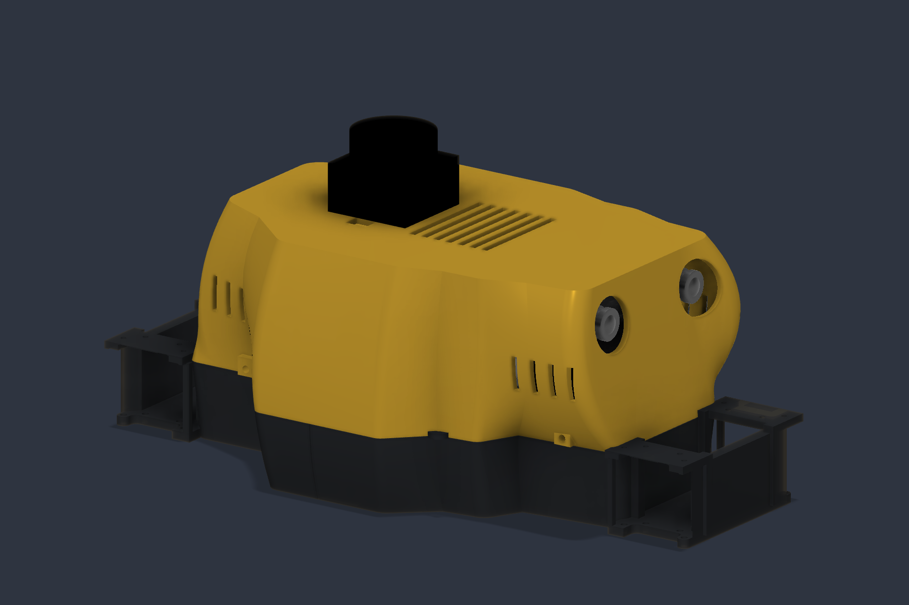
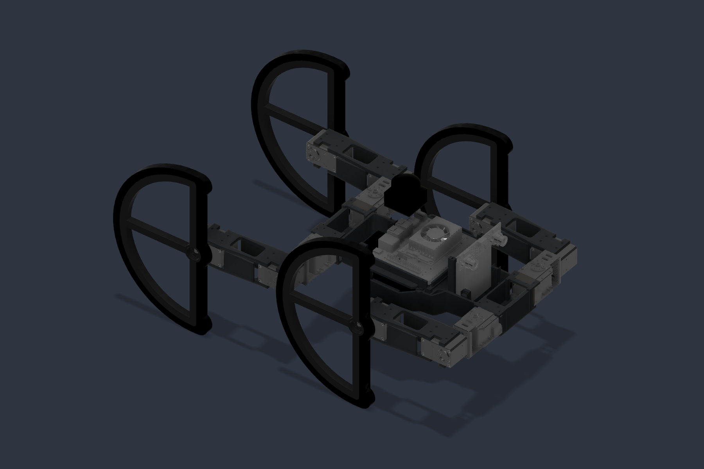
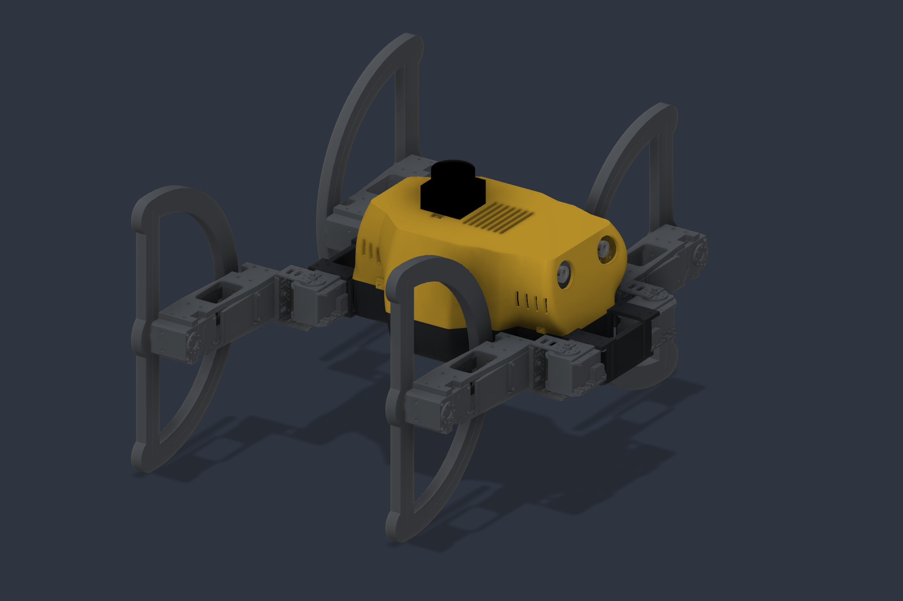

# MARC Housing PLA R03 — 설계·출력 인계서

2026-09-15 · 256mm급 프린터 · 구조물 PLA / 타이어 TPU

**Fusion 최종 작업 파일: MARC Housing PLA R03 v1.** 원본 `MARC v11`은 수정되지 않았다. 원본 타임라인, 부품 형상, 배치, 조인트, 파라미터를 작업 전 기록과 대조했다. 사본의 ARC 형상도 네 다리 모두 유지했다. 근거는 `preservation_check.json`이다.

이 결과는 **CAD 간섭 검증을 마친 시제품 설계**다. 실제 PLA 강도·열변형·케이블 움직임·조립 공차·최종 나사는 실물 시험으로 확정한다. 모든 관절 조합 또는 무제한 회전을 허용하는 설계라고 해석하지 않는다.

## 1. 이번 변경

- 상·하부가 동일한 둘레선을 따라 이어지는 곡면 외피. 하부 앞·뒤를 분할해 각각 256mm 출력 공간에 배치한다.
- MX28 케이스를 아래와 위에서 고정하는 일체형 상부 지지부. 상부 회전 혼과 고정부는 분리되어 있다. 원래 모터 중심과 하부 체결 위치를 유지했다.
- 최신 요구 자세인 **MX28 안쪽 90° / 힙 XM430:2 180° / 말단 XM430:1 0–360°**에 맞춰 몸체 허리와 받침을 정리했다.
- 두 장으로 분리돼 있던 LINK를 하나의 리브 구조로 연결했다. 모터 체결 구멍, 외곽 치수, 122.5mm 축간거리는 유지하고 중앙에 경량화 창을 냈다. 각 LINK CAD 체적은 38.521 → 36.941cm³, **4.10% 감소**했다. 강성 증가율을 계산하거나 실험한 것은 아니다.
- Jetson 트레이, 배터리 스트랩 구멍, PCB 레일, U2D2 받침, 카메라 체결부, 라이다 직접 장착부 및 통풍구를 배치했다.

## 2. 출력 파일과 수량

STL은 **mm 단위, 권장 출력 방향, 바닥 Z=0**이다. 자동 크기 보정/축척 변경을 사용하지 않는다. STEP은 조립 좌표를 유지하며, 원본 부품·구형 숨김 부품·전자부품 참조가 섞이지 않은 별도 출력 부품 파일이다.

| 파일 | 부품 | 수량 | 출력 방향의 크기 X×Y×Z(mm) |
|---|---|---:|---:|
| R01_PLA_mm.stl | 뒤 하부 프레임 + MX28 상부 지지 | 1 | 144.39 × 154.00 × 40.50 |
| R02_PLA_mm.stl | 앞 하부 프레임 + MX28 상부 지지 + PCB 레일 | 1 | 162.46 × 154.00 × 81.50 |
| R03_PLA_mm.stl | 상부 센서 커버 | 1 | 214.57 × 154.00 × 70.20 |
| P04_PLA_mm.stl | Jetson 트레이 | 1 | 98.00 × 128.00 × 12.90 |
| L01_PLA_mm.stl | 일반 LINK | 2 | 123.75 × 38.50 × 38.20 |
| L02_PLA_mm.stl | 미러 LINK | 2 | 123.75 × 38.50 × 38.20 |

하우징은 **4개**, LINK까지 포함하면 총 **8개 출력물 / 6종**이다. ARC·타이어·모터·공장제 브래킷은 이번 STL 묶음에 포함하지 않는다. ARC를 임의로 변경하거나 공장제 서보 부품을 PLA로 치환하지 않는다.

모든 출력 부품은 네이티브 CAD에서 연결된 솔리드 1개다. STL의 열린/비정상 공유 모서리는 0개다. 일부 CAD 면 경계의 삼각형 연결은 정점을 이동하지 않는 분할로 보정했다. 메시와 CAD 체적 차이는 0.05% 미만이다. 상세 수치는 `print_manifest.json`에 있다.

하우징 4개를 빈틈 없이 PLA로 채웠을 때의 CAD 질량 합은 약 **570g**이다. 실제 출력 질량은 벽 수·상하면·인필에 따라 달라진다. CAD 재료는 밀도 1.24g/cm³를 사용한 질량 추정용이며, 재료 라이브러리의 기계 물성을 FDM PLA 강도 데이터로 사용하면 안 된다.

### 시작용 출력 조건

- 기준: 0.4mm 노즐, 0.2mm 레이어. 실제 PLA 브랜드의 온도·냉각 조건을 따른다.
- R01/R02/LINK: 외벽 6줄, 상·하면 6층, 인필 40–50%를 첫 시제품 기준으로 사용한다. 모터 지지·분할 연결부는 국부 고밀도 설정을 사용한다.
- 커버: 외벽 4–5줄, 상·하면 5–6층. 외피의 명목 안쪽 오프셋은 2.6mm이며, 곡면 로프트 방식이므로 모든 위치에서 일정한 벽 두께라는 뜻은 아니다.
- R01/R02: 바닥을 베드에 놓는다. **MX28 위쪽 지지부와 분할 맞물림 아래에는 서포트가 필요할 수 있다.** 모터 삽입 공간으로 제거할 수 있게 서포트를 배치하고, 슬라이서 단면에서 제거 경로를 확인한다.
- 커버: 평평한 지붕이 베드에 닿도록 뒤집는다. 센서 브래킷/측면 구멍의 국부 서포트는 미리보기로 확인한다.
- LINK: 제공된 파일처럼 긴 측면 리브를 베드에 놓는다. 서보 접합면·구멍 안에 제거하기 어려운 서포트를 채우지 않는다.
- 인필만 높여 층간 박리나 나사 주변 파손이 해결된다고 가정하지 않는다. 먼저 한쪽 프레임과 LINK를 출력해 모터 삽입·나사 체결을 시험한다.

## 3. MX28 상·하부 체결

고정 대상은 **모터 케이스의 기존 M2 계열 구멍**이다. 회전 혼 구멍을 몸체에 묶으면 자유도가 사라지므로 사용하지 않는다.

좌표: +X 앞, +Y 왼쪽, +Z 위. 앞 모터 중심 X=208.108703, 뒤=-41.891297mm. 각 모터 위쪽 지지판의 예시 구멍은 다음과 같다.

- X = 모터 중심 ±15mm, |Y| = 35.640926mm
- X = 모터 중심 ±8.5mm, |Y| = 29.340926mm
- 오른쪽은 Y<0, 왼쪽은 Y>0. 각 모터 4개, 전체 16개.
- 지지판 명목 Z=33.3–36.7mm, 구멍 Ø2.3mm. 실제 케이스 돌출부에 맞춘 여유 절삭이 포함된다.

| 용도 | 현재 모델 / 예시 규격 | 확정 전 확인 |
|---|---|---|
| MX28 상부 | M2×6, 16개, Ø2.3 관통 | 케이스 내 나사 진입 깊이와 와셔 두께 |
| MX28 하부 | 기존 체결 위치·구멍 유지 | 원래 사용하던 나사/하중 경로 |
| 하부 앞뒤 연결 | Ø4.3 관통, M4×25 + 너트/와셔 4세트 | 실제 적층 두께와 너트 공간 |
| 커버 | Ø3.3 관통과 Ø2.5 파일럿, M3×16 예시 4개 | PLA 직접 나사 또는 인서트 규격 결정 |
| 트레이 | M3×10 예시 4개 | 뒤 (39,±59), 앞 (125,±50) 위치 |
| 카메라 | M2 파일럿 4개 | 모듈 체결부/실제 나사 길이 |
| 라이다 | Ø2.3 관통 2개 | 제조사 M2 체결·머리 규격 |

파일럿 구멍에 실제 나사산 또는 특정 열압입 인서트가 모델링되어 있다는 뜻은 아니다. 인서트를 정하면 해당 구멍만 그 제품 외경·길이에 맞춰 바꾼다. 모터 좌표·ARC는 변경하지 않는다.

Jetson은 제조사 플라스틱 베이스를 유지한 둘레 받침 방식이다. 임의의 베이스 구멍 패턴을 만들지 않았다. 뒤쪽 트레이의 예시 M3 파일럿과 비전도성 누름 와셔/클립으로 베이스 가장자리를 고정하는 시험이 필요하다. PCB나 커넥터를 누르는 고정 방식은 사용하지 않는다.

## 4. 전자부품 배치와 치수 근거

| 부품 | 적용된 크기 / 상태 | 장착·배선 |
|---|---|---|
| Jetson Orin Nano Super Dev Kit | 완제품 명목 103 × 90.5 × 34.77mm. 공식 STEP의 베이스·포트·냉각부 포함, 작은 수동소자 일부만 제외 | 팬 위 통풍구, 포트는 뒤쪽(-X), 트레이 분리 가능 |
| IMX219-83 stereo | 공식 STEP 85.2 × 24 × 17.060mm, 축척 변경 없음 | 앞쪽 2개 광학 개구, 2개 CSI 케이블 경로 |
| T-mini Plus | 외곽 38.6 × 38.6 × 33.9mm, 상부 Ø36.2mm. 외형 단순화 참조 | 지붕 직접 고정, 별도 받침 없음 |
| U2D2 | 48 × 18 × 14.9mm 외곽 참조 | 뒤쪽 받침, USB 및 다이나믹셀 연결 공간 |
| Custom PCB | 70 × 60 × 1.6mm 설계 외곽, 장착 시 Y60/Z70 | 부품 깊이 16mm를 별도 참조로 확보. 실제 회로·발열·커넥터는 미확정 |
| 배터리 | 78 × 94 × 28mm **사용자 정의 팩 설계 공간** | 바닥 러너, 스트랩 고정, 트레이를 들어내면 분리 |

Jetson 공식 사양과 CAD는 [NVIDIA carrier board specification](https://developer.nvidia.com/downloads/assets/embedded/secure/jetson/orin_nano/docs/jetson_orin_nano_devkit_carrier_board_specification_sp.pdf), [하드웨어 안내](https://docs.nvidia.com/jetson/orin-nano-devkit/user-guide/hardware_layout.html)를 사용했다. USB-C는 데이터/복구용이며 전원·디스플레이 입력이 아니다. 디스플레이는 DP를 사용한다.

카메라 기준은 [Waveshare 공식 문서](https://www.waveshare.com/wiki/IMX219-83_Stereo_Camera) 및 연결된 공식 STEP이다. Orin에는 적합한 15→22핀 CSI 케이블 2개가 필요하다. 라이다는 제조사 T-mini Plus 데이터시트의 외형·장착 치수를 사용했다. U2D2는 [ROBOTIS 공식 문서](https://emanual.robotis.com/docs/en/parts/interface/u2d2/)를 따랐다. U2D2는 다이나믹셀에 전력을 공급하지 않으며, 사용자의 USB 커넥터 세대는 아직 확인되지 않았다.

배터리는 구매 제품이 확정된 것이 아니다. 참고 셀로 [Molicel P45B 공식 데이터시트](https://www.molicel.com/wp-content/uploads/INR21700P45B_1.4_Product-Data-Sheet-of-INR-21700-P45B-80109.pdf)의 최대 Ø21.55 × 70.15mm를 사용하면 4셀 평면 배열을 이 공간 안에서 검토할 수 있다. 절연재·배선·보호회로/BMS까지 포함한 실제 팩 외곽은 별도 확인이 필요하다.

4S 팩을 택하면 완충 16.8V를 MX28에 직접 연결하지 않는다. [ROBOTIS MX28 규격](https://emanual.robotis.com/docs/en/dxl/mx/mx-28-2/)은 10–14.8V, 권장 12V다. 전원 PCB는 배터리 보호/퓨즈 이후 **다이나믹셀 12V 계통**, **Jetson 허용 입력 범위에 맞는 별도 안정화 계통**, **센서 전원 계통**으로 설계한다. 순간·회생 전류, 컨버터 전력, 커넥터 정격은 아직 확정하지 않았다.

## 5. 배선과 정비

Fusion의 `W01 Wiring route study`는 숨겨진 배선 경로 참조다. 실제 구매 케이블의 굽힘 반경·플러그 외곽을 검증한 완제품 하네스가 아니다. 좌표와 가정한 선 굵기는 `r03_routes.json`에 정리했다.

- 뒤쪽 USB-C/이더넷 서비스 개구까지 짧은 연장 케이블을 사용한다. 실제 Jetson 포트 위치에서 옆으로 돌아 개구에 접근하도록 경로를 잡았다. 개구가 해당 포트 바로 앞에 있다는 뜻은 아니다.
- 두 CSI 케이블은 카메라 뒤에서 상부로 빼고 팬 회전부를 피해 Jetson CSI 쪽으로 내려간다. FFC는 일반 원형 전선 참조와 다른 납작한 케이블이므로 실제 굽힘 형상 확인이 필요하다.
- 배터리와 PCB를 연결하는 선은 가운데 브리지 위쪽으로 지나간다. 하부 바퀴 통과 공간으로 늘어뜨리지 않는다.
- 좌우 서보 하네스는 몸체 안쪽을 따라 네 MX28 근처로 분기하고, MX28 ±90°를 위한 여유 루프와 고정점을 둔다.
- 말단 ARC가 회전해도 전선은 고정된 모터 케이스로 들어간다. 힙 모터까지 계속 같은 방향으로 무제한 회전시키는 경우의 케이블 비틀림은 별도 문제다.
- 분해 순서: 전원 분리 → 커버 나사 → 카메라/라이다 케이블 → 커버 → Jetson 고정부/트레이 → 배터리 스트랩. 배터리 교체를 위해 다리를 분리할 필요는 없다.
- PLA와 Jetson을 함께 사용하므로 실제 팬 작동, 내부 온도, 하중 상태에서의 장시간 변형을 확인한다. 이 설계는 방수 구조가 아니다.

## 6. 회전 검증 범위

앞 오른쪽 기준 축 좌표(mm): MX28 (208.108703,-65.140926,39), 힙 (208.108703,-95.140926,18.5), 말단의 기준 자세 축 (85.608703,-138.140926,18.5).

MX28 안쪽 +90°는 이 다리의 월드 좌표에서 Z축 -90° 회전이다. 힙 180°에서 바퀴 중심은 Y=-187.640926, Z=18.5 부근이다. 원래 10mm ARC의 회전축 방향 범위는 X=125.308703–135.308703이고, 최대 반지름은 122.5mm다.

- 네 하우징 부품 간 실체 겹침: 0.
- 실제 크기의 전자부품 참조와 하우징 간 실체 겹침: 0.
- 기본 다리 자세 및 지정한 앞 오른쪽 힙180 자세의 프레임 간섭: 0.
- 바퀴를 모든 각도로 돌렸을 때 차지하는 원기둥 전체를 사용한 몸체 검사: 0. 반지름 124.6mm, 축 방향 여유까지 포함했다. 20mm 폭 후보의 안쪽/바깥쪽 확장 공간도 함께 확보했다.
- 네 다리를 지정 자세에 둔 진단 배치에서 다른 다리와 바퀴 회전 공간 간섭: 0.
- 메시 검사의 상시 허브 접촉은 네이티브 실체 검사에서 0–355°를 5° 간격으로 확인했으며 겹침 체적 0, 계산 실패 0이었다.

위 결과는 **지정 자세에서의 말단 회전 공간**에 대한 것이다. 그 자세까지 이동하는 경로, 모든 힙 각도, 동적 처짐, TPU 눌림, 나사 머리·최종 케이블의 움직임까지 증명한 것은 아니다. `CHECK MX28 90 HIP180`은 진단용 복제 형상이며 생산 조인트를 변경한 것이 아니다. 보통은 숨겨두고, 확인 이미지처럼 비교할 때만 켠다.

## 7. 20mm 바퀴 폭 제안

**현재 ARC와 타이어 형상은 그대로 두었다. 20mm는 선택 후보다.**

2° 간격의 임시 메시 비교에서 ARC 전체 또는 타이어 참조를 가운데 기준으로 두 배 두껍게 하면 링크·허브와 새로운 접촉이 생겼다. 반면 **안쪽 면을 유지하고 TPU 타이어를 바깥쪽으로 10mm 확장**한 후보는 기존 허브 접촉 외의 새로운 접촉이 없었다. 이 비교는 최신 LINK 경량화 이전의 동일 외곽 링크를 사용한 폭 후보 검토이며, 최종 타이어 설계의 승인 검사는 아니다.

권장 후속안은 PLA ARC 코어·허브·장착면을 유지하면서 TPU 바깥쪽 폭을 15mm와 20mm로 비교하는 것이다. 폭만 균일하게 10→20mm 늘리면 해당 타이어 부분의 질량과 회전 관성도 대략 두 배가 될 수 있다. 한쪽 확장으로 무게 중심이 약 5mm 바깥으로 이동하면 같은 힘 F에 대한 추가 굽힘 모멘트는 약 F×0.005 N·m다. TPU 경도, 코어에 물리는 폭, 옆으로 접히는 변형, 접착/기계적 고정은 시제품으로 결정한다.

## 8. 다음 에이전트의 작업 경계

- 시작 파일은 `MARC_Housing_PLA_R03.f3d` 또는 같은 이름의 Fusion 클라우드 파일이다. 원본 MARC, A01, P02를 편집하지 않는다.
- 숨겨진 이전 부품은 이력/조인트 참조용이다. 재출력할 때 전체 문서를 통째로 STL 변환하지 말고 이 폴더의 6종 출력 파일 또는 현재 표시된 최종 부품을 사용한다.
- 현 단계의 미확정 항목: PLA 브랜드/출력 보정, 최종 나사/인서트, 배터리 팩 및 보호회로, 실제 PCB와 컨버터 발열, U2D2 커넥터 세대, 구매 케이블·연장 포트, Jetson 베이스 고정 방식의 실물 확인.
- ARC 폭을 실제로 바꾸려면 사용자의 선택을 받은 뒤 별도 타이어 사본에서 작업한다. 먼저 안쪽 장착면을 고정하고 바깥쪽만 확장하며, 다시 360° 간섭과 실물 옆방향 변형을 검사한다.
- 최초 조립은 전원을 넣지 않은 상태에서 전체 회전 범위를 손으로 확인한다. 그 뒤 낮은 토크에서 케이블과 체결부 움직임을 확인하고, 실사용 하중·충격·열 시험으로 범위를 넓힌다.

`print_manifest.json`, `motion_validation.json`, `preservation_check.json`, `r03_check.json`, `r03_routes.json`, `r03_link_optimization.json`이 이 인계서의 검증 기록이다.
